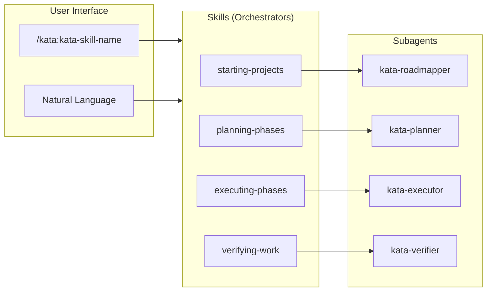
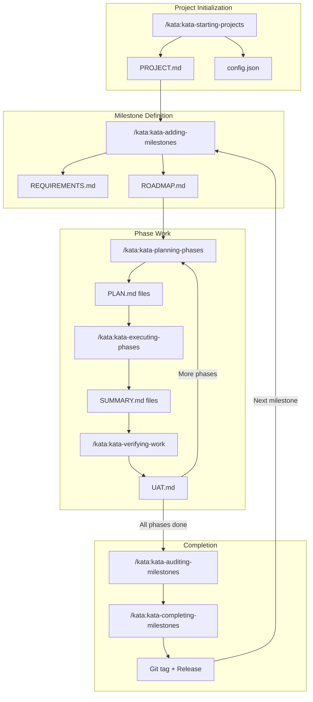
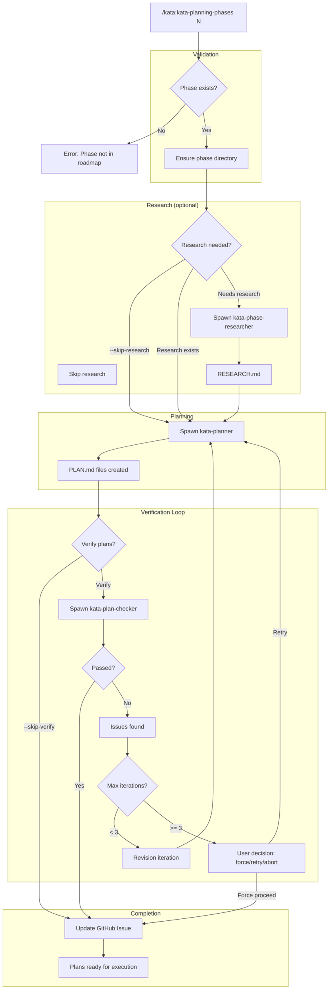
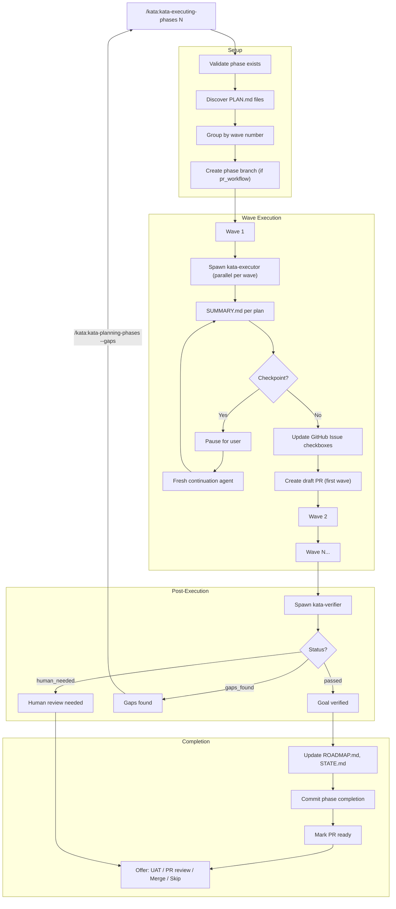
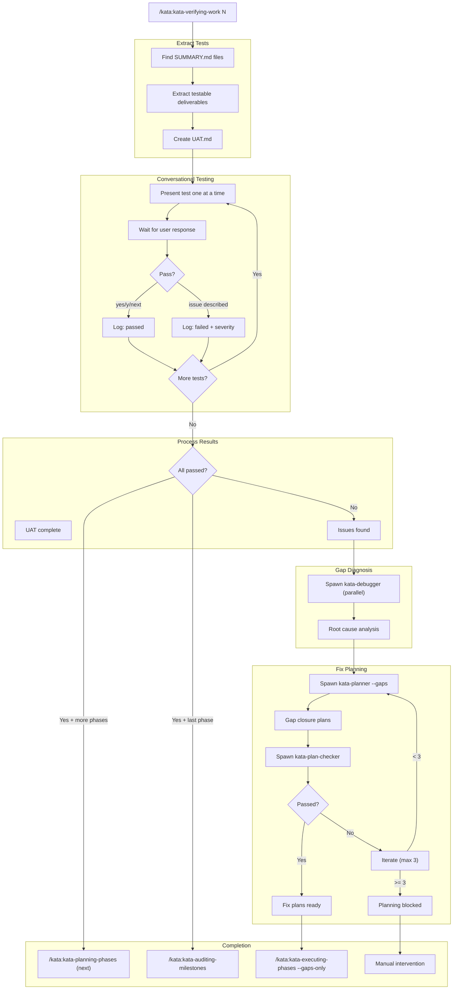
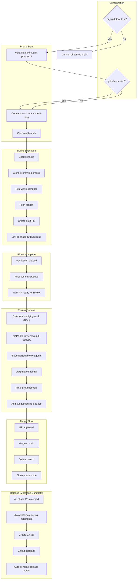

# Kata Orchestrator: User Journeys

This document maps the complete user experience through Kata's spec-driven development workflows, showing how skills orchestrate specialized agents to deliver structured, traceable development processes.

---

## Table of Contents

1. [High-Level Orchestration](#1-high-level-orchestration)
2. [Project Lifecycle](#2-project-lifecycle)
3. [Planning Flow](#3-planning-flow)
4. [Execution Flow](#4-execution-flow)  
5. [Verification Flow](#5-verification-flow)
6. [PR Workflow](#6-pr-workflow)
7. [Quick Reference](#quick-reference)

---

## 1. High-Level Orchestration

**Pattern:** User → Skill (Orchestrator) → Agent (Specialist)

This is the fundamental architecture of Kata Orchestrator. Users interact with **skills** using natural language or slash commands. Skills act as **thin orchestrators** (~15% context budget), spawning **specialized agents** that receive fresh context (100% of 200k tokens) to perform deep work.



> **Note:** This diagram shows the core skill-to-agent pattern. The complete Kata suite includes 27 skills and 19 specialized agents. See the [full catalog](#quick-reference) below.

### Why This Architecture?

**Context efficiency:** Skills stay lean by delegating deep work to agents. Each agent loads full project context (PROJECT.md, ROADMAP.md, research, etc.) in a fresh 200k token window.

**Specialization:** Agents are purpose-built:
- `kata-planner` → Creates execution plans with dependency analysis
- `kata-executor` → Executes a single plan with checkpointing
- `kata-verifier` → Post-execution goal verification
- `kata-debugger` → Root cause analysis for failures
- `kata-code-reviewer` → PR code review with 6 analysis dimensions

**Natural invocation:**
```
User: "plan phase 2"
Assistant: [Invokes /kata:kata-planning-phases 2]

User: "execute the foundation phase"
Assistant: [Invokes /kata:kata-executing-phases 1]

User: "run UAT on phase 3"
Assistant: [Invokes /kata:kata-verifying-work 3]
```

---

## 2. Project Lifecycle

**Journey:** Project initialization → Milestone definition → Phase work (plan → execute → verify) → Completion → Release

This state machine shows the complete development lifecycle managed by Kata.



### Artifact Trail

Each stage produces traceable artifacts in `.planning/`:

| Stage | Artifacts | Purpose |
|-------|-----------|---------|
| **Initialization** | `PROJECT.md`, `config.json` | Vision, requirements, workflow config |
| **Milestone** | `REQUIREMENTS.md`, `ROADMAP.md` | Scoped requirements (IDs), phase structure |
| **Planning** | `phases/NN-name/NN-NN-PLAN.md`, `RESEARCH.md` | Executable plans, research context |
| **Execution** | `phases/NN-name/NN-NN-SUMMARY.md` | Deliverables, implementation notes |
| **Verification** | `phases/NN-name/NN-VERIFICATION.md`, `UAT.md` | UAT results, gap analysis |
| **Completion** | `milestones/vX.Y.Z/`, Git tag | Archived work, release notes |

---

## 3. Planning Flow

**Skill:** `/kata:kata-planning-phases N`  
**Purpose:** Create executable PLAN.md files for a phase with optional research and mandatory verification

This workflow ensures every phase has thoroughly researched, validated plans before execution begins.



---

## 4. Execution Flow

**Skill:** `/kata:kata-executing-phases N`  
**Purpose:** Execute all plans in a phase with wave-based parallelization, checkpointing, and verification

This is the execution engine of Kata, orchestrating parallel agents with automatic dependency resolution.



---

## 5. Verification Flow

**Skill:** `/kata:kata-verifying-work N`  
**Purpose:** Conversational UAT (User Acceptance Testing) with automated gap diagnosis and fix planning

This workflow transforms deliverables into testable assertions and guides users through validation.



---

## 6. PR Workflow

**Configuration:** `pr_workflow: true` in `config.json`  
**Purpose:** Branch-based pull request workflow with GitHub integration

This optional workflow creates isolated branches per phase with draft PRs for review.



---

## Quick Reference

### All Skills (27)

**Project Lifecycle:**
- `/kata:kata-starting-projects` - Initialize PROJECT.md with deep questioning
- `/kata:kata-adding-milestones` - Create requirements + roadmap
- `/kata:kata-planning-phases` - Create PLAN.md files with research
- `/kata:kata-executing-phases` - Wave-based execution
- `/kata:kata-verifying-work` - Conversational UAT
- `/kata:kata-auditing-milestones` - Pre-completion audit
- `/kata:kata-completing-milestones` - Archive + release

**Phase Operations:**
- `/kata:kata-discussing-phases` - Phase definition conversation
- `/kata:kata-researching-phases` - Deep research only
- `/kata:kata-archiving-phases` - Move phase to archive
- `/kata:kata-canceling-phases` - Cancel in-progress phase
- `/kata:kata-inserting-phases` - Insert new phase in roadmap
- `/kata:kata-moving-phases` - Reorder phases
- `/kata:kata-renaming-phases` - Rename phase

**Pull Request:**
- `/kata:kata-reviewing-pull-requests` - Spawn 6 review agents

**Debugging:**
- `/kata:kata-debugging` - General debugging with kata-debugger
- `/kata:kata-finding-silent-failures` - Detect subtle bugs

**Todo Management:**
- `/kata:kata-adding-todos` - Add structured todos
- `/kata:kata-completing-todos` - Mark todos complete
- `/kata:kata-listing-todos` - Show all todos
- `/kata:kata-prioritizing-todos` - Reorder by priority

**Tracking:**
- `/kata:kata-tracking-progress` - Status reports
- `/kata:kata-tracking-requirements` - Requirement coverage

**Utility:**
- `/kata:kata-continuing-work` - Resume after checkpoint
- `/kata:kata-mapping-codebase` - Generate codebase map
- `/kata:kata-reviewing-docs` - Documentation review

### All Agents (19)

**Planning:**
- `kata-planner` - Creates PLAN.md files
- `kata-plan-checker` - Validates plans
- `kata-roadmapper` - Creates ROADMAP.md

**Execution:**
- `kata-executor` - Executes single plan
- `kata-verifier` - Post-execution verification

**Research:**
- `kata-project-researcher` - Project-level research
- `kata-phase-researcher` - Phase-specific research
- `kata-research-synthesizer` - Consolidate findings
- `kata-codebase-mapper` - Generate codebase map
- `kata-integration-checker` - Validate integrations

**Debugging:**
- `kata-debugger` - Root cause analysis
- `kata-failure-finder` - Find breaking changes
- `kata-silent-failure-hunter` - Detect subtle bugs

**Review:**
- `kata-code-reviewer` - Code quality review
- `kata-pr-test-analyzer` - Test coverage analysis
- `kata-type-design-analyzer` - TypeScript/type analysis
- `kata-comment-analyzer` - Documentation coverage
- `kata-code-simplifier` - Suggest simplifications

**Entity:**
- `kata-entity-generator` - Generate data models

---

## Key Concepts

### Plans ARE Prompts

PLAN.md files are **executable XML documents**, not just markdown descriptions. The planner crafts these as precise instructions for the executor agent.

**Example plan structure:**

```xml
<plan>
  <context>
    @.planning/PROJECT.md
    @.planning/REQUIREMENTS.md (REQ-001, REQ-003)
    @src/models/task.ts
  </context>

  <objective>
    Implement REST API endpoints for task CRUD operations
  </objective>

  <wave>1</wave>
  <depends_on></depends_on>

  <tasks>
    <task>
      <description>Create Express router for /tasks</description>
      <acceptance>
        - Router file exists at src/routes/tasks.ts
        - Router registered in src/app.ts
        - TypeScript compiles without errors
      </acceptance>
    </task>

    <task>
      <description>Implement GET /tasks endpoint</description>
      <implementation_notes>
        - Use Task model from src/models/task.ts
        - Return all tasks from database
        - Handle empty result (return empty array)
        - Error handling: 500 on database errors
      </implementation_notes>
      <acceptance>
        - Endpoint responds to GET /tasks
        - Returns JSON array of tasks
        - Status code 200 on success
        - Status code 500 on errors
      </acceptance>
      <test_requirements>
        - Unit test: mock database, verify task return
        - Integration test: real database, verify full flow
        - Error test: database failure returns 500
      </test_requirements>
    </task>
  </tasks>

  <verification>
    <command>npm test</command>
    <success_criteria>
      - All tests pass
      - Coverage > 80% for new files
    </success_criteria>
  </verification>
</plan>
```

The executor reads this as its primary instruction set, supplemented with full project context.

### Wave-Based Parallelization

**Why waves?** Plans often have dependencies. Running them in parallel would cause race conditions or missing prerequisites.

**How it works:**
1. Planner analyzes dependencies
2. Assigns wave numbers (1 = foundation, 2+ = depends on earlier waves)
3. Executor groups by wave
4. Runs wave 1 plans in parallel
5. Waits for all wave 1 to complete
6. Runs wave 2 plans in parallel
7. Continues until complete

**Example:**

```
Phase 2: API Layer

Wave 1 (parallel):
  - 02-01-database-models.md (foundation)
  - 02-02-api-types.md (foundation)

Wave 2 (depends on wave 1):
  - 02-03-rest-endpoints.md (needs models)
  - 02-04-graphql-schema.md (needs types)

Wave 3 (depends on wave 2):
  - 02-05-api-tests.md (needs endpoints)
```

### Thin Orchestrators, Fresh Agents

**Problem:** Long-running skills accumulate context, hitting token limits.

**Solution:** Skills stay lean (~15% context), delegating to fresh agents (100% context per spawn).

**Example:** `/kata:kata-executing-phases 3`

```
Skill context budget (~30k tokens):
  - Read ROADMAP.md
  - Discover PLAN.md files (3 plans)
  - Group by wave
  - Spawn 3 kata-executor agents (parallel)

Each agent's context budget (~200k tokens):
  - @.planning/PROJECT.md (full vision)
  - @.planning/REQUIREMENTS.md (all requirements)
  - @.planning/ROADMAP.md (full roadmap)
  - @.planning/phases/03-*/03-RESEARCH.md (research findings)
  - @.planning/phases/03-*/03-01-PLAN.md (just this plan)
  - @src/** (all relevant code files)
  - Full execution autonomy
```

---

## Configuration

**Location:** `.planning/config.json`

```json
{
  "mode": "interactive",              // "yolo" | "interactive"
  "depth": "standard",                // "quick" | "standard" | "comprehensive"
  "model_profile": "balanced",        // "quality" | "balanced" | "budget"
  "workflow": {
    "research": true,                 // Research before planning
    "plan_check": true,               // Verify plans
    "verifier": true                  // Post-execution verification
  },
  "github": {
    "enabled": false,                 // GitHub integration
    "issueMode": "auto",             // "auto" | "ask" | "never"
    "repo": "owner/repo"             // Auto-detected from git remote
  },
  "pr_workflow": false,               // Branch + PR per phase
  "commit_docs": true,                // Track .planning/ in git
  "parallelization": true             // Parallel plan execution
}
```

---

**Document Version:** 1.0  
**Last Updated:** 2026-01-30  
**Maintainer:** Kata Orchestrator Team
