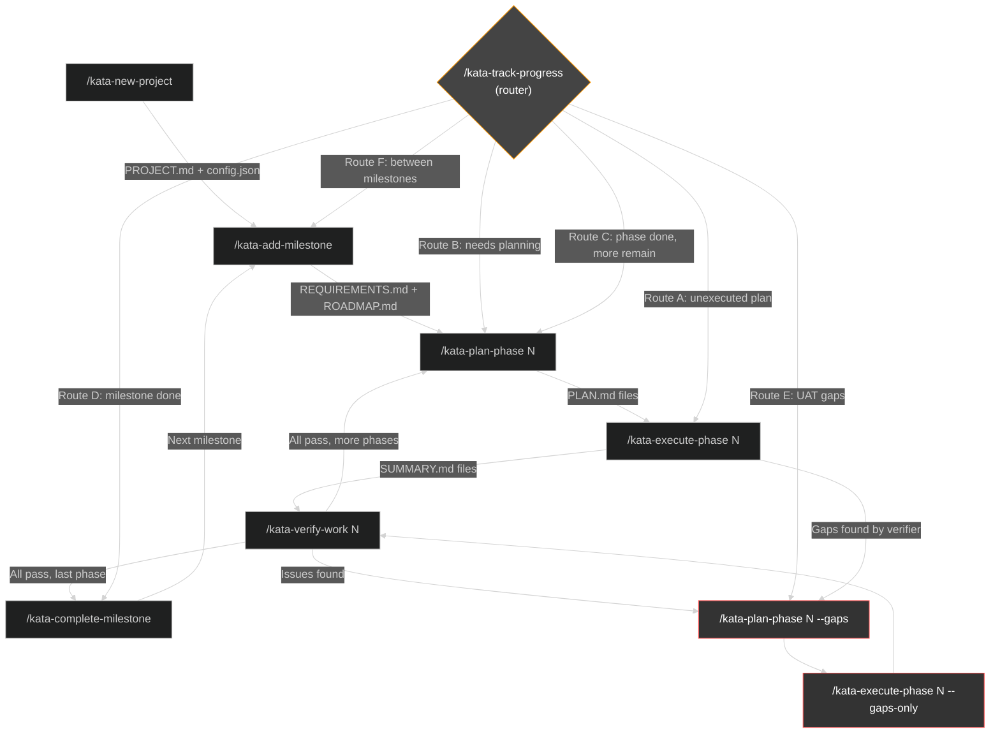
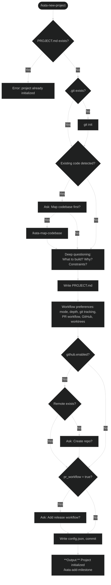
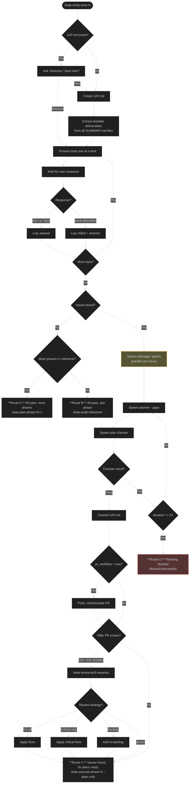

# Kata Workflow Routes

Complete decision gate and routing documentation for all Kata workflow skills.

## 1. Lifecycle Overview

The main loop with all cross-skill handoffs and alternative routes.

## 2. Track Progress (Router)

Central router that inspects project state and directs to the correct skill.

```mermaid
%%{init: {'theme': 'dark'}}%%
flowchart TD
    START(["/kata-track-progress"])

    G0{".planning/ exists?"}
    START --> G0
    G0 -->|No| ERR0["Error: no planning structure<br/>Suggest /kata-new-project"]

    G1{"ROADMAP.md exists?"}
    G0 -->|Yes| G1

    G1F{"PROJECT.md exists?"}
    G1 -->|No| G1F
    G1F -->|Yes| RF["**Route F**<br/>Between milestones"]
    G1F -->|No| ERR0

    LOAD["Load STATE.md, ROADMAP.md,<br/>config.json, phase directories"]
    G1 -->|Yes| LOAD

    LOAD --> COUNT["Count PLAN.md, SUMMARY.md,<br/>UAT.md files for current phase"]

    COUNT --> G5{"UAT gaps > 0?"}
    G5 -->|Yes| RE["**Route E**<br/>UAT gaps need fix plans<br/>/kata-plan-phase N --gaps"]

    G5 -->|No| G5B{"summaries < plans?"}
    G5B -->|Yes| RA["**Route A**<br/>Unexecuted plan exists<br/>/kata-execute-phase N"]

    G5B -->|No| G5C{"plans = 0?"}
    G5C -->|Yes| RB["**Route B**<br/>Phase needs planning<br/>/kata-plan-phase N"]

    G5C -->|No| G5D["summaries = plans<br/>(all executed)"]
    G5D --> G6{"current phase < highest phase?"}
    G6 -->|Yes| RC["**Route C**<br/>Phase done, more remain<br/>/kata-plan-phase N+1"]
    G6 -->|No| RD["**Route D**<br/>Milestone complete<br/>/kata-complete-milestone"]

    RF -.->|handoff| AM_LINK["/kata-add-milestone"]
    RE -.->|handoff| GPP_LINK["/kata-plan-phase --gaps"]
    RA -.->|handoff| EP_LINK["/kata-execute-phase"]
    RB -.->|handoff| PP_LINK["/kata-plan-phase"]
    RC -.->|handoff| PP_LINK2["/kata-plan-phase N+1"]
    RD -.->|handoff| CM_LINK["/kata-complete-milestone"]

    style RE fill:#553,stroke:#f90
    style RA fill:#353,stroke:#0f0
    style RB fill:#335,stroke:#09f
    style RC fill:#335,stroke:#09f
    style RD fill:#535,stroke:#f0f
    style RF fill:#444,stroke:#999
```

## 3. New Project

## 4. Add Milestone

```mermaid
%%{init: {'theme': 'dark'}}%%
flowchart TD
    START(["/kata-add-milestone"])

    LOAD["Load PROJECT.md, STATE.md,<br/>MILESTONES.md, config.json"]
    START --> LOAD

    LOAD --> G1_5{"User wants to brainstorm?"}
    G1_5 -->|Yes| BRAIN["/kata-brainstorm"] --> GOALS
    G1_5 -->|No| GOALS

    GOALS{"MILESTONE-CONTEXT.md exists?"}
    GOALS -->|Yes| USE_CTX["Use features from context"]
    GOALS -->|No| ASK_GOALS["Ask: What to build next?"]
    USE_CTX --> VER
    ASK_GOALS --> VER

    VER["Determine version number,<br/>confirm with user"]
    VER --> UPD["Update PROJECT.md, STATE.md"]
    UPD --> GH_M{"github.enabled?"}

    GH_M -->|Yes| GH_R{"Remote exists?"}
    GH_R -->|No| ASK_GH["Ask: Create repo or skip GitHub?"]
    GH_R -->|Yes| CREATE_M["Create GitHub milestone"]
    ASK_GH --> COMMIT1
    CREATE_M --> COMMIT1
    GH_M -->|No| COMMIT1

    COMMIT1["Commit milestone start"]

    COMMIT1 --> G7{"User wants domain research?"}
    G7 -->|Yes| RESEARCH["Spawn 4 parallel researchers<br/>+ synthesizer"]
    G7 -->|No| G7_5
    RESEARCH --> G7_5

    G7_5{"Backlog issues exist?"}
    G7_5 -->|Yes| ISSUES["Ask: Select issues for scope"]
    G7_5 -->|No| REQS
    ISSUES --> REQS

    REQS["Spawn requirements agent<br/>Feature categorization + scoping<br/>Generate REQUIREMENTS.md"]
    REQS --> COMMIT2["Commit REQUIREMENTS.md"]

    COMMIT2 --> G8_5{"Phase prefix collisions?"}
    G8_5 -->|Yes| MIGRATE["Ask: Migrate to sequential numbering?<br/>Run /kata-doctor"]
    G8_5 -->|No| ROAD
    MIGRATE --> ROAD

    ROAD["Spawn roadmapper agent"]
    ROAD --> G9{"Roadmapper result?"}
    G9 -->|ROADMAP BLOCKED| HELP["Get user help, re-spawn"]
    HELP --> ROAD
    G9 -->|ROADMAP CREATED| APPROVE{"User approves?"}
    APPROVE -->|Adjust| ROAD
    APPROVE -->|Accept| COMMIT3["Commit ROADMAP.md"]

    COMMIT3 --> G9_5{"github.enabled + issueMode != never?"}
    G9_5 -->|Yes| GH_ISSUES["Create GitHub issue per phase"]
    G9_5 -->|No| DONE
    GH_ISSUES --> DONE

    DONE["**Output:** Milestone initialized<br/>/kata-plan-phase N"]
```

## 5. Plan Phase

```mermaid
%%{init: {'theme': 'dark'}}%%
flowchart TD
    START(["/kata-plan-phase N [flags]"])
    FLAGS["Parse flags:<br/>--research, --skip-research,<br/>--gaps, --skip-verify"]
    START --> FLAGS

    FLAGS --> G1{".planning/ exists?"}
    G1 -->|No| ERR["Error: suggest /kata-new-project"]

    G1 -->|Yes| G2{"Phase arg provided?"}
    G2 -->|No| AUTO["Auto-detect next unplanned phase"]
    G2 -->|Yes| NORM["Normalize phase number"]
    AUTO --> G3
    NORM --> G3

    G3{"Collision detected?<br/>(duplicate phase prefixes)"}
    G3 -->|Yes| ERR2["Error: run /kata-doctor first"]

    G3 -->|No| G3_5{"model_profile set?"}
    G3_5 -->|No| ASK_MODEL["AskUserQuestion:<br/>quality / balanced / budget"]
    G3_5 -->|Yes| G4
    ASK_MODEL --> G4

    G4{"Existing PLAN.md files?"}
    G4 -->|Yes| ASK_EXIST["Ask: Continue / View / Replan?"]
    ASK_EXIST -->|Continue| G5
    ASK_EXIST -->|Replan| G5
    G4 -->|No| G5

    G5{"Research decision"}
    G5_GAPS{"--gaps flag?"}
    G5 --> G5_GAPS
    G5_GAPS -->|Yes| PLANNER
    G5_GAPS -->|No| G5_SKIP{"--skip-research flag?"}
    G5_SKIP -->|Yes| PLANNER
    G5_SKIP -->|No| G5_CFG{"workflow.research = false<br/>AND no --research flag?"}
    G5_CFG -->|Yes| PLANNER
    G5_CFG -->|No| G5_EXIST{"RESEARCH.md exists<br/>AND no --research flag?"}
    G5_EXIST -->|Yes| USE_EXIST["Use existing research"] --> PLANNER
    G5_EXIST -->|No| SPAWN_R["Spawn researcher agent"]

    SPAWN_R --> G6{"Research result?"}
    G6 -->|RESEARCH BLOCKED| ASK_BLOCK["Ask: provide context / skip / abort"]
    ASK_BLOCK -->|provide| SPAWN_R
    ASK_BLOCK -->|skip| PLANNER
    ASK_BLOCK -->|abort| ABORT["Exit"]
    G6 -->|Success| PLANNER

    PLANNER["Spawn planner agent"]
    PLANNER --> G7{"Plan result?"}
    G7 -->|PLANNING COMPLETE| G8

    G8{"--skip-verify flag?"}
    G8 -->|Yes| GH
    G8 -->|No| G8_CFG{"workflow.plan_check = true?"}
    G8_CFG -->|No| GH
    G8_CFG -->|Yes| CHECKER["Spawn plan checker"]

    CHECKER --> G9{"Checker result?"}
    G9 -->|Pass| GH
    G9 -->|ISSUES FOUND| G9_MAX{"iteration >= 3?"}
    G9_MAX -->|No| PLANNER
    G9_MAX -->|Yes| ASK_FORCE["Ask: force / retry / abandon"]
    ASK_FORCE -->|force| GH
    ASK_FORCE -->|retry| PLANNER
    ASK_FORCE -->|abandon| ABORT2["Exit"]

    GH{"github.enabled +<br/>issueMode != never?"}
    GH -->|Yes| GH_UPD["Create/update GitHub issue"]
    GH -->|No| DONE
    GH_UPD --> DONE

    DONE["**Output:** Phase planned<br/>/kata-execute-phase N"]

    style G5_GAPS fill:#553,stroke:#f90
    style G9_MAX fill:#533,stroke:#f55
```

## 6. Execute Phase

```mermaid
%%{init: {'theme': 'dark'}}%%
flowchart TD
    START(["/kata-execute-phase N [flags]"])
    FLAGS["Parse: --gaps-only"]
    START --> FLAGS

    FLAGS --> G1["Validate phase exists<br/>(find-phase.sh)"]
    G1 --> G1_ERR{"Found?"}
    G1_ERR -->|No| ERR["Error: phase not found"]

    G1_ERR -->|Yes| G1_25{"Phase in pending/?"}
    G1_25 -->|Yes| MOVE_A["Move to active/"]
    G1_25 -->|No| G1_5
    MOVE_A --> G1_5

    G1_5{"pr_workflow = true?"}
    G1_5 -->|Yes| BRANCH["Create phase branch"]
    G1_5 -->|No| DISC
    BRANCH --> DISC

    DISC["Discover PLAN.md files,<br/>check for existing SUMMARY.md"]
    DISC --> G2{"--gaps-only?"}
    G2 -->|Yes| FILTER["Filter to gap_closure plans only"]
    G2 -->|No| GROUP
    FILTER --> GROUP

    GROUP["Group plans by wave number"]

    GROUP --> WAVE["**For each wave (sequential):**"]
    WAVE --> SPAWN["Spawn all plans in wave<br/>(parallel Task calls)"]
    SPAWN --> GH_CHK{"github.enabled?"}
    GH_CHK -->|Yes| GH_UPD["Update issue checkboxes"]
    GH_CHK -->|No| W_NEXT
    GH_UPD --> W_NEXT

    W_NEXT{"First wave + pr_workflow?"}
    W_NEXT -->|Yes| DRAFT["Create draft PR"]
    W_NEXT -->|No| W_MORE
    DRAFT --> W_MORE

    W_MORE{"More waves?"}
    W_MORE -->|Yes| WAVE
    W_MORE -->|No| G6

    G6{"Uncommitted changes?"}
    G6 -->|Yes| FIX_COMMIT["Commit orchestrator corrections"]
    G6 -->|No| G6_5
    FIX_COMMIT --> G6_5

    G6_5{"npm test detected?"}
    G6_5 -->|Yes| TEST["Run tests (non-blocking)"]
    G6_5 -->|No| G7
    TEST --> G7

    G7{"verifier workflow enabled?"}
    G7 -->|No| G7_5
    G7 -->|Yes| VERIFY["Spawn verifier agent"]
    VERIFY --> G7R{"Verifier result?"}
    G7R -->|passed| G7_5
    G7R -->|gaps_found| ROUTE_GAPS["**Route: gap closure**<br/>/kata-plan-phase N --gaps"]
    G7R -->|human_needed| ASK_HUMAN["Present checklist,<br/>get user approval"]
    ASK_HUMAN --> G7_5

    G7_5["Move phase to completed/"]
    G7_5 --> UPD["Update ROADMAP.md, STATE.md,<br/>REQUIREMENTS.md"]
    UPD --> COMMIT["Commit phase completion,<br/>stage directory move"]

    COMMIT --> G10_5{"pr_workflow = true?"}
    G10_5 -->|Yes| PR_READY["Push branch, mark PR ready"]
    G10_5 -->|No| DONE
    PR_READY --> DONE

    DONE{"More phases in milestone?"}
    DONE -->|Yes| OUT_MORE["**Output:** Phase complete<br/>/kata-verify-work N"]
    DONE -->|No| OUT_LAST["**Output:** Milestone complete<br/>/kata-verify-work N"]

    style ROUTE_GAPS fill:#533,stroke:#f55
    style SPAWN fill:#353,stroke:#0f0
```

## 7. Verify Work

## 8. Complete Milestone

```mermaid
%%{init: {'theme': 'dark'}}%%
flowchart TD
    START(["/kata-complete-milestone"])

    G0{"pr_workflow = true<br/>AND on main?"}
    START --> G0
    G0 -->|Yes| RBRANCH["Create release/vX.Y.Z branch"]
    G0 -->|No| G0_2
    RBRANCH --> G0_2

    G0_2{"Release workflow configured?"}
    G0_2 -->|Yes| BUMP["Auto-detect version,<br/>bump, generate changelog"]
    G0_2 -->|No| G1
    BUMP --> G1

    G1{"MILESTONE-AUDIT.md exists?"}
    G1 -->|No| WARN["Warn: recommend /kata-audit-milestone"]
    G1 -->|Yes| G1_CHK{"Audit status?"}
    G1_CHK -->|passed| G2
    G1_CHK -->|gaps_found| WARN
    WARN --> G2

    G2["Verify readiness:<br/>count phases, plans, summaries"]
    G2 --> CONFIRM["Present stats, wait for confirmation"]

    CONFIRM --> G3{"User wants demo walkthrough?"}
    G3 -->|Yes| DEMO["Create UAT scenarios, walk through"]
    DEMO --> G3_ISS{"Issues found?"}
    G3_ISS -->|Yes| ASK_FIX["Ask: Fix before release?"]
    ASK_FIX -->|Yes| BACK["Return to execution"]
    ASK_FIX -->|No| DOC_ISS["Document as known issues"]
    DOC_ISS --> STATS
    G3_ISS -->|No| STATS
    G3 -->|No| STATS

    STATS["Gather stats, extract accomplishments"]
    STATS --> ARCHIVE["Archive milestone:<br/>copy ROADMAP + REQUIREMENTS to milestones/,<br/>delete REQUIREMENTS.md,<br/>update PROJECT.md"]

    ARCHIVE --> G6_5{"User wants README revision?"}
    G6_5 -->|Yes| README["Show README, get approval"]
    G6_5 -->|No| G6_7
    README --> G6_7

    G6_7{"github.enabled?"}
    G6_7 -->|Yes| CLOSE_M["Close GitHub milestone"]
    G6_7 -->|No| COMMIT
    CLOSE_M --> COMMIT

    COMMIT["Commit all artifacts"]
    COMMIT --> G7{"pr_workflow = true?"}
    G7 -->|Yes| PR["Push release branch,<br/>create PR with Closes #N"]
    G7 -->|No| TAG["Create local tag"]
    TAG --> ASK_PUSH["Ask: Push tag?"]
    PR --> VERIFY
    ASK_PUSH --> VERIFY

    VERIFY["Ask: Release verification complete?"]
    VERIFY --> DONE["**Output:** Milestone complete<br/>/kata-add-milestone"]

    style BACK fill:#553,stroke:#f90
```

## Route Index

Every named route across all skills.

| Route | Skill | Entry Condition | Destination |
| --- | --- | --- | --- |
| **Route A** | track-progress | Unexecuted plans exist (summaries < plans) | `/kata-execute-phase N` |
| **Route B** | track-progress | Phase has no plans (plans = 0) | `/kata-plan-phase N` |
| **Route C** | track-progress | All plans executed, more phases remain | `/kata-plan-phase N+1` |
| **Route D** | track-progress | All plans executed, last phase in milestone | `/kata-complete-milestone` |
| **Route E** | track-progress | UAT gaps diagnosed (uat_with_gaps > 0) | `/kata-plan-phase N --gaps` |
| **Route F** | track-progress | Between milestones (no ROADMAP.md, has PROJECT.md) | `/kata-add-milestone` |
| **Gap closure** | execute-phase | Verifier finds gaps after execution | `/kata-plan-phase N --gaps` |
| **Route A** | verify-work | All UAT tests pass, more phases remain | `/kata-plan-phase N+1` |
| **Route B** | verify-work | All UAT tests pass, last phase | `/kata-audit-milestone` |
| **Route C** | verify-work | Issues found, fix plans created | `/kata-execute-phase N --gaps-only` |
| **Route D** | verify-work | Fix planning blocked after 3 iterations | Manual intervention |

## Config-Dependent Branches

Branches that activate based on `.planning/config.json` settings.

| Config Key | When True | When False |
| --- | --- | --- |
| `pr_workflow` | Create branches, draft PRs, mark ready, release branches | Commit directly to main |
| `github.enabled` | Create milestones, phase issues, update checkboxes, close on completion | Skip all GitHub integration |
| `github.issueMode` | `always`: create issues for every phase. `never`: skip. `ask`: prompt user | N/A |
| `workflow.research` | Run research agent before planning | Skip research unless `--research` flag |
| `workflow.plan_check` | Run plan checker after planner | Skip verification unless plans fail |
| `workflow.verifier` | Run verifier after execution | Skip post-execution verification |
| `model_profile` | `quality` / `balanced` / `budget` controls agent model selection | Prompt user to choose |

## Loops

Bounded iteration loops in the system.

| Loop | Location | Max Iterations | Escape |
| --- | --- | --- | --- |
| Plan checker revision | plan-phase | 3 | User decides: force / retry / abandon |
| Gap plan checker | verify-work | 3 | Route D: manual intervention |
| Roadmapper blocked | add-milestone | Unbounded (user-driven) | User provides context or abandons |
| Demo walkthrough issues | complete-milestone | 1 | Fix before release or document as known |
