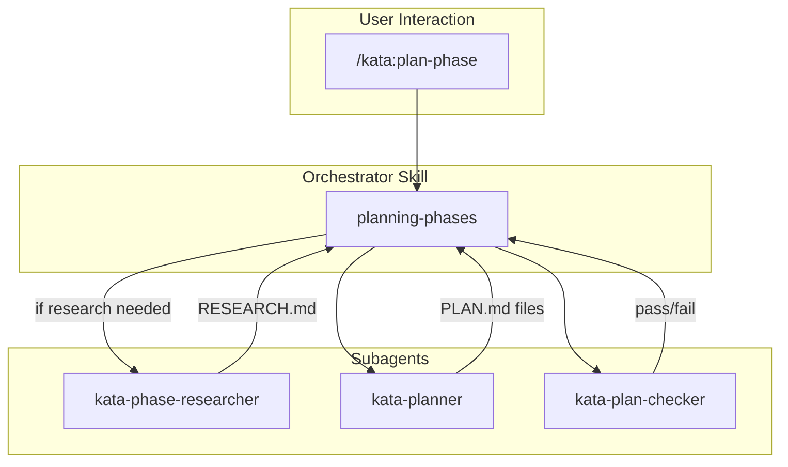
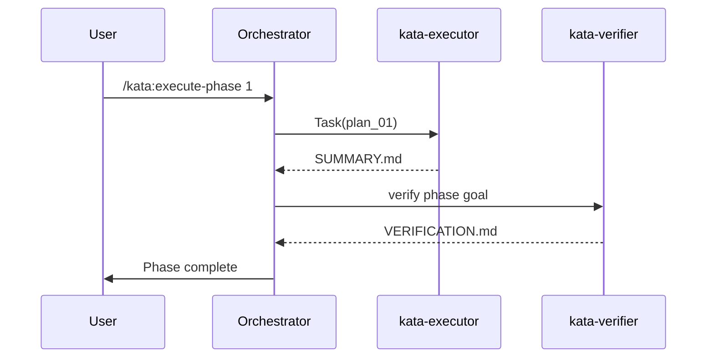
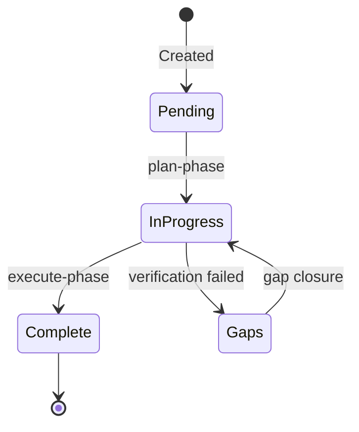
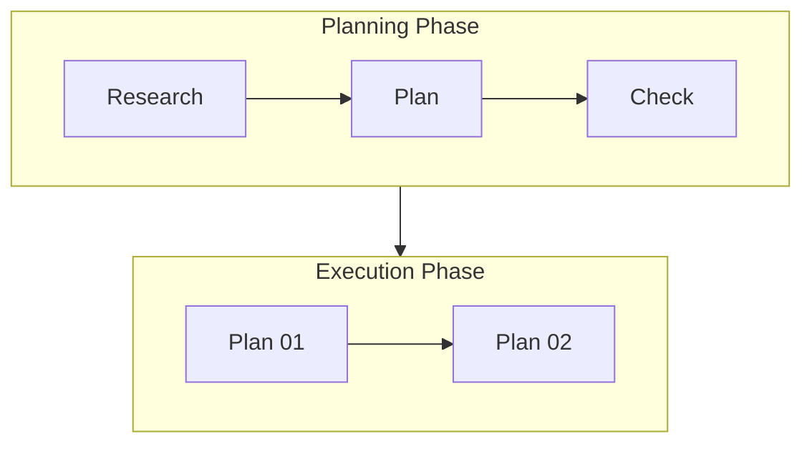
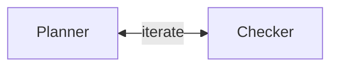
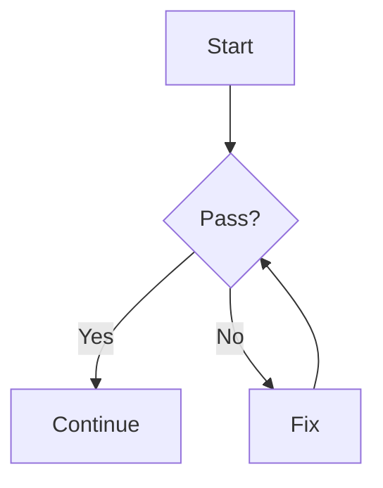
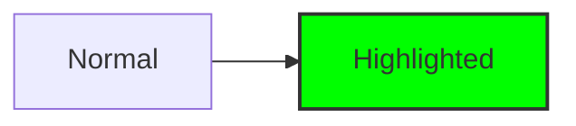
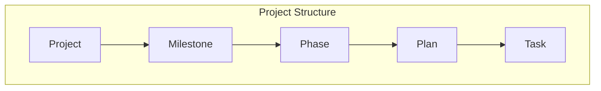

# Phase 1: Internal Documentation - Research

**Researched:** 2026-01-29
**Domain:** Mermaid diagrams, technical documentation, glossary structure
**Confidence:** HIGH

## Summary

This research investigates how to create effective internal documentation for Kata, specifically Mermaid flow diagrams and a terminology glossary. The diagrams will document Kata's major workflow paths (orchestration, lifecycle, planning, execution, verification, PR), while the glossary will define key terms (milestone, phase, plan, etc.) with clear relationships.

Mermaid is the right choice for these diagrams since GitHub renders Mermaid natively in markdown files, aligning with Kata's git-centric workflow. The diagrams will live in `.docs/` (existing documentation directory) for progressive disclosure, not cluttering SKILL.md files that agents load into context.

**Primary recommendation:** Create 6 Mermaid flowcharts covering the major workflow paths, plus 1 glossary document with term definitions and relationship diagrams. Store in `.docs/diagrams/` and `.docs/glossary/` respectively.

## Standard Stack

The established tools for this documentation:

### Core
| Tool/Format | Version | Purpose | Why Standard |
| --- | --- | --- | --- |
| Mermaid | 11.x (latest) | Flow diagrams in markdown | GitHub-native rendering, text-based, version-controllable |
| Markdown | N/A | Documentation format | Already used throughout Kata, universal rendering |

### Supporting
| Tool | Purpose | When to Use |
| --- | --- | --- |
| Mermaid Live Editor | Interactive diagram editing | Development and testing before committing |
| GitHub Preview | Native rendering verification | Verify diagrams render correctly in repo |

### Alternatives Considered
| Instead of | Could Use | Tradeoff |
| --- | --- | --- |
| Mermaid | PlantUML | PlantUML requires Java, more complex syntax; Mermaid is lighter |
| Mermaid | Draw.io | Draw.io creates binary files, harder to diff/version |
| Mermaid | ASCII art | ASCII doesn't scale well for complex flows |

**No installation needed:** Mermaid diagrams are native markdown code blocks that GitHub renders automatically.

## Architecture Patterns

### Recommended Documentation Structure
```
.docs/
├── diagrams/
│   ├── FLOWS.md              # All flow diagrams in one navigable file
│   └── README.md             # Index/navigation for diagrams
└── glossary/
    └── GLOSSARY.md           # Complete terminology reference
```

**Rationale:**
- `.docs/` already exists in the project (contains GITHUB_WORKFLOWS.md)
- Keeps documentation separate from skill references (which agents load)
- Progressive disclosure: only loaded when explicitly needed
- Not in `skills/*/references/` because this is project-level, not skill-specific

### Pattern 1: Flowchart for Orchestration Paths

**What:** Top-down flowchart showing skill-to-agent routing
**When to use:** Documenting which agents a skill spawns and in what order
**Example:**


### Pattern 2: Sequence Diagram for Agent Interactions

**What:** Sequence diagram showing message flow between components
**When to use:** Documenting time-ordered interactions in complex workflows
**Example:**


### Pattern 3: State Diagram for Lifecycle

**What:** State machine showing artifact states
**When to use:** Documenting the lifecycle of plans, phases, milestones
**Example:**


### Anti-Patterns to Avoid
- **Overloaded diagrams:** Split complex flows into multiple focused diagrams
- **Inline in SKILL.md:** These increase context size; keep diagrams in separate files
- **Missing legends:** Always include a legend or subgraph labels explaining node types
- **Deep nesting:** Avoid more than 2 levels of subgraphs

## Don't Hand-Roll

Problems that look simple but have existing solutions:

| Problem | Don't Build | Use Instead | Why |
| --- | --- | --- | --- |
| Diagram rendering | Custom SVG generation | Mermaid in markdown | GitHub renders natively |
| Diagram editing | Custom editor | mermaid.live | Interactive, shows errors |
| Cross-linking docs | Custom link resolution | Relative markdown links | Standard, works in GitHub |
| Diagram versioning | Export images | Keep as markdown | Text diffs, version control |

**Key insight:** Mermaid's text-based format means diagrams are as versionable as code. No binary exports needed.

## Common Pitfalls

### Pitfall 1: Overcomplicating Single Diagrams
**What goes wrong:** One diagram tries to show everything, becomes unreadable
**Why it happens:** Natural tendency to be comprehensive
**How to avoid:** One diagram per workflow path; use subgraphs sparingly
**Warning signs:** Diagram needs scrolling, nodes overlap

### Pitfall 2: Inconsistent Node Naming
**What goes wrong:** Same concept called different things in different diagrams
**Why it happens:** Different diagrams written at different times
**How to avoid:** Define canonical names in glossary first, reference consistently
**Warning signs:** "executor" vs "kata-executor" vs "execute agent"

### Pitfall 3: Diagrams Drift from Reality
**What goes wrong:** Diagrams show old workflow, code has changed
**Why it happens:** Code updated but docs not
**How to avoid:** Review diagrams during phase planning that touches affected skills
**Warning signs:** Developers confused by diagram not matching behavior

### Pitfall 4: Glossary Terms Without Context
**What goes wrong:** Definitions exist but relationships unclear
**Why it happens:** Focus on individual terms, not system
**How to avoid:** Include relationship diagram, group related terms
**Warning signs:** Users still confused about how terms relate

## Code Examples

Verified patterns from official Mermaid documentation:

### Flowchart with Subgraphs


### Bidirectional Arrows for Loops


### Decision Diamonds


### Styling for Emphasis


## Diagram Inventory

Based on the success criteria and Kata's architecture, these diagrams are needed:

### 1. High-Level Orchestration (Users -> Commands -> Skills -> Agents)
Shows the layered architecture: how users interact with commands, commands invoke skills, skills spawn agents.

### 2. Project Lifecycle (new-project -> milestones -> phases -> plans -> execution)
Shows the complete lifecycle from initialization through milestone completion.

### 3. Planning Flow (research -> plan -> check -> approve)
Details the planning-phases skill workflow with iteration loop.

### 4. Execution Flow (waves, checkpoints, deviation handling)
Details the executing-phases skill including parallel execution and checkpoint handling.

### 5. Verification Flow (verifier -> debugger -> UAT)
Details the verifying-work skill including diagnostic agent spawning.

### 6. PR Workflow (branch -> PR -> review -> merge)
Details the PR-based workflow when pr_workflow is enabled.

## Glossary Structure

### Recommended Format: Definition Lists with Relationships

```markdown
## Core Concepts

### Milestone
**Definition:** A versioned release target (e.g., v1.1.0) containing multiple phases.

**Relationships:**
- Contains: 1 or more Phases
- Tracked by: GitHub Milestone (if enabled)
- Produces: MILESTONES.md archive entry

**Lifecycle:** Planned -> In Progress -> Complete -> Archived
```

### Recommended Term Categories

1. **Project Structure:** Project, Milestone, Phase, Plan, Task
2. **Artifacts:** PROJECT.md, ROADMAP.md, STATE.md, REQUIREMENTS.md, PLAN.md, SUMMARY.md
3. **Agents:** Orchestrator, Subagent, Researcher, Planner, Checker, Executor, Verifier
4. **Workflows:** Planning, Execution, Verification, UAT, Gap Closure
5. **GitHub Integration:** Issue, PR, Milestone (GitHub), Branch

### Include: Relationship Diagram



## State of the Art

| Old Approach | Current Approach | When Changed | Impact |
| --- | --- | --- | --- |
| ASCII diagrams | Mermaid | ~2020 | Native GitHub rendering |
| Image exports | Text-based diagrams | ~2020 | Version control friendly |
| External tools | In-repo documentation | ~2023 | Single source of truth |

**Current:** Mermaid 11.x is stable and widely supported. GitHub, GitLab, and most markdown renderers support it natively.

## Open Questions

1. **Diagram location: .docs/ vs skills/references/?**
   - What we know: .docs/ exists, skills/references/ are for skill-specific progressive disclosure
   - What's unclear: Whether these docs should be loadable by agents
   - Recommendation: Use .docs/ for human documentation, not agent context

2. **Should glossary be machine-readable (JSON/YAML)?**
   - What we know: Current docs are markdown
   - What's unclear: Whether agents need structured term lookups
   - Recommendation: Markdown for now, can add frontmatter or JSON export later if needed

## Sources

### Primary (HIGH confidence)
- Mermaid Official Syntax Reference (https://mermaid.js.org/intro/syntax-reference.html) - diagram types, syntax
- Kata codebase analysis (skills/*/SKILL.md, agents/*.md) - workflow patterns

### Secondary (MEDIUM confidence)
- Mermaid Chart Documentation (https://docs.mermaidchart.com/mermaid-oss/syntax/flowchart.html) - flowchart best practices
- Markdown Definition Lists Guide (https://blog.markdowntools.com/posts/markdown-definition-lists-complete-guide) - glossary formatting

### Tertiary (LOW confidence)
- General web search for documentation patterns - needs validation against Kata conventions

## Metadata

**Confidence breakdown:**
- Standard stack: HIGH - Mermaid is well-established, GitHub-native
- Architecture: HIGH - Follows existing Kata patterns, .docs/ exists
- Pitfalls: MEDIUM - Based on general documentation experience, may need Kata-specific additions

**Research date:** 2026-01-29
**Valid until:** Stable documentation; valid indefinitely unless Kata architecture changes
