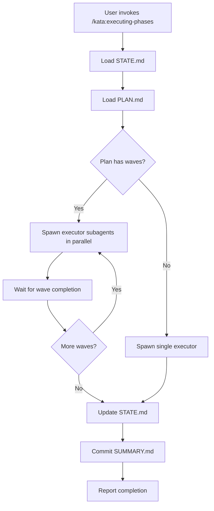

# Feature Landscape

**Domain:** Release automation and workflow documentation tools
**Researched:** 2026-01-28
**Confidence:** HIGH

## Table Stakes

Features users expect from release automation and workflow documentation tools. Missing these = product feels incomplete.

| Feature | Why Expected | Complexity | Notes |
|---------|--------------|------------|-------|
| **Semantic versioning** | Industry standard (SemVer). Users expect MAJOR.MINOR.PATCH bumping based on commit type | Low | Already implemented via `.claude-plugin/plugin.json` version field |
| **Changelog generation** | Every release tool generates changelog from commits. Users expect to not write changelogs manually | Medium | Currently manual CHANGELOG.md. Should auto-generate from conventional commits |
| **Tag creation** | Git tags are fundamental to releases. Users expect tags created automatically at release time | Low | CI creates tags via `gh release create` — already implemented |
| **GitHub Release creation** | Standard GitHub workflow. Users expect release notes published to GitHub Releases page | Low | Already implemented in `plugin-release.yml` |
| **Version bump automation** | Users expect version incremented automatically based on commit messages (feat/fix/BREAKING) | Medium | Currently manual `.claude-plugin/plugin.json` edit. Should auto-bump |
| **Conventional commit parsing** | Standard for all modern release tools. Parse `feat:`, `fix:`, `BREAKING CHANGE:` from commits | Medium | Kata enforces this in commit conventions but doesn't parse for releases |
| **Publish trigger** | Users expect "merge to main → auto-publish" workflow. No manual steps after PR merge | Low | Already implemented — CI triggers on push to main |
| **Idempotent releases** | Releases should be safe to re-run. Skip if version already published | Low | Already implemented — checks marketplace version before publishing |
| **Quickstart documentation** | First-time users expect "/docs/quickstart.md" or "Getting Started" in README | Low | Currently missing. README has install but no "first task" tutorial |
| **Command reference** | Users expect complete list of available commands with descriptions | Low | `/kata:help` exists but not documented in README/docs |

## Differentiators

Features that set Kata apart from generic release automation tools. Not expected, but valuable for Claude Code context.

| Feature | Value Proposition | Complexity | Notes |
|---------|-------------------|------------|-------|
| **Milestone-triggered release** | When GitHub milestone closes → auto-trigger release process. Ties release to roadmap completion | Medium | Kata-specific: milestones represent phases. Completing milestone = phase done → release |
| **Phase completion validation** | Verify all phase tasks complete before allowing release. Prevents releasing half-done work | Medium | Kata-specific: check SUMMARY.md tasks, verify tests pass, ensure no TODOs in phase issues |
| **Workflow diagrams (Mermaid)** | Visual documentation of orchestrator → subagent flows. Helps users understand complex workflows | High | Differentiator: most tools document with prose. Kata's multi-agent orchestration benefits from visual flow |
| **ASCII workflow diagrams** | Terminal-friendly workflow visualization for `/kata:help` output. Works without graphics | Medium | Unique to CLI-first tools. Shows workflow in terminal without opening browser |
| **Statusline project info** | Show current phase, milestone, task count in statusline. Contextual awareness at a glance | Medium | Claude Code-specific. Few tools integrate with editor statusline |
| **Interactive onboarding wizard** | First-run experience: "Want to try a sample task?" → walks through planning → execution → verification cycle | High | Differentiator: most CLIs show static tutorial. Interactive wizard demonstrates value immediately |
| **Release notes from SUMMARY.md** | Extract accomplishments from phase SUMMARY.md files instead of just commit messages. Higher-level narrative | Medium | Kata-specific: SUMMARY.md has goals/accomplishments. More meaningful than raw commits |
| **Commit verification** | Enforce conventional commits at commit time. Block non-compliant commits via git hook | Low | Already possible via hooks. Differentiator: catch problems early, not at release time |
| **Dry-run mode** | Preview what would be released without publishing. Shows version bump, changelog, affected files | Low | Standard in npm/cargo but often missing in custom release tools |
| **Rollback support** | If release fails validation, revert version bump and tag. Clean failure recovery | Medium | Differentiator: most tools leave failed releases in broken state |

## Anti-Features

Features to explicitly NOT build. Common mistakes in release automation and documentation tools.

| Anti-Feature | Why Avoid | What to Do Instead |
|--------------|-----------|-------------------|
| **Manual version selection** | Asking user "What version?" defeats semantic versioning automation. Introduces human error | Parse commits → determine version automatically. User never picks version |
| **Changelog in commit body** | Asking "Write release notes for this commit" bloats commits and creates duplicate effort | Generate changelog from commit subjects. Keep commits focused on code changes |
| **Breaking change prompts** | Interactive "Is this breaking?" prompt during commit. Interrupts flow, error-prone | Enforce `BREAKING CHANGE:` in commit message. Parse automatically. Git hook warns if missing on major changes |
| **Monolithic workflow diagram** | Single giant Mermaid diagram for all Kata workflows. Overwhelming, unmaintainable | One diagram per orchestrator skill. Show specific flow (e.g., phase-execute flow, not "all of Kata") |
| **Video tutorials** | Video walkthrough of using Kata. Becomes outdated quickly, not searchable | Text-based quickstart with copy-paste commands. Code samples in README |
| **Auto-merge PRs** | Release automation merges release PR automatically. Removes human oversight | Create release PR, wait for human review and merge. Automate everything after merge |
| **Skip CI on release** | Publishing without running tests "because it's just a version bump". Breaks deployments | Always run full test suite before publishing. Version bumps can introduce regressions |
| **Changelog style bikeshedding** | Configurable changelog templates, emoji support, custom sections. Feature creep | Use conventional-changelog default format. Consistent, widely recognized |
| **Multi-format diagrams** | Support Mermaid + PlantUML + GraphViz. Maintenance burden, inconsistent rendering | Mermaid only. Native GitHub support, consistent rendering, active development |
| **Statusline kitchen sink** | Show git status, time, weather, quotes in statusline. Distracts from project context | Show only project-relevant info: current phase, milestone, active task. Keep focused |
| **Wizard for experienced users** | Force interactive tutorial on every user. Annoying for people who read docs | Detect first run → offer tutorial. Provide `/kata:tutorial` command for opt-in |
| **Release branches** | Create release/1.2.0 branches for every release. Adds complexity, requires backport strategy | Release from main. Tag commits. Simple linear history |

## Feature Dependencies

```
Semantic Versioning
└── Conventional Commit Parsing (requires commit message analysis)
    ├── Changelog Generation (requires parsed commits)
    ├── Version Bump Automation (requires determining semver change)
    └── Breaking Change Detection (requires parsing commit bodies)

GitHub Release Creation
└── Tag Creation (release requires tag)
    └── Version Bump (tag uses version number)

Milestone-Triggered Release (Kata-specific)
└── Phase Completion Validation (must verify phase done)
    ├── SUMMARY.md parsing (check all tasks complete)
    └── GitHub Issue check (verify issue closed)

Workflow Diagrams
└── (No dependencies — purely documentation)

Statusline
└── Project state parsing (must read .planning/STATE.md)
    └── (Optional) Git status integration (show branch/dirty state)

Onboarding Wizard
└── Sample project template (need valid PROJECT.md/ROADMAP.md)
    └── Test harness (wizard must create verifiable task)
```

## MVP Recommendation

For v1.3.0 (Release Automation & Workflow Docs milestone):

**Must have (table stakes):**
1. **Changelog auto-generation** — Parse conventional commits → generate CHANGELOG.md section
2. **Version bump automation** — Analyze commits since last tag → bump `.claude-plugin/plugin.json` version
3. **Quickstart documentation** — README section: "Try Kata in 5 minutes" with copy-paste commands
4. **Workflow diagrams (select workflows)** — Mermaid diagrams for core flows (planning, execution, verification)

**Nice to have (differentiators):**
1. **Milestone completion trigger** — Close milestone → prompt "Ready to release?"
2. **Statusline project info** — Show current phase/milestone in statusline
3. **Dry-run mode** — Preview release without publishing

**Defer to post-v1.3.0:**
- **Interactive onboarding wizard** — Complex, needs design. Ship quickstart docs first
- **Phase completion validation** — Valuable but not blocking. Manual verification works for now
- **Release notes from SUMMARY.md** — Nice-to-have. Commit-based changelog sufficient initially
- **Commit verification hook** — Enforcement is good but not release-critical
- **Rollback support** — Edge case. Handle manually for now

## Implementation Notes

### Changelog Generation

**Current state:** Manual CHANGELOG.md updates
**Target:** Auto-generate changelog section from commits

**Approach:**
- Use `conventional-changelog` or similar (HIGH confidence — industry standard)
- Extract commits since last tag: `git log v1.2.0..HEAD --format="%s|%b"`
- Parse commit types: `feat:` → Features, `fix:` → Bug Fixes, `BREAKING CHANGE:` → Breaking Changes
- Generate Markdown section for current version
- Insert at top of CHANGELOG.md (preserve existing content)

**Complexity:** Medium. Parsing is straightforward, but must handle:
- Multi-line commit bodies
- Non-conventional commits (skip or warn?)
- Merge commits (filter out)

### Version Bump Automation

**Current state:** Manual edit of `.claude-plugin/plugin.json`
**Target:** Auto-determine next version from commits

**Approach:**
1. Get last tag: `git describe --tags --abbrev=0`
2. Get commits since last tag: `git log <last-tag>..HEAD --format="%s|%b"`
3. Analyze commits:
   - Contains `BREAKING CHANGE:` anywhere → MAJOR bump
   - Contains `feat:` → MINOR bump
   - Contains `fix:` → PATCH bump
   - No relevant commits → No release needed
4. Calculate new version: `semver <last-version> -i <major|minor|patch>`
5. Update `.claude-plugin/plugin.json` version field
6. Commit with message: `chore: bump version to X.Y.Z`

**Complexity:** Medium. Must handle:
- No last tag (initial release → 1.0.0)
- Version conflicts (what if version already manually bumped?)
- Multiple commit types (BREAKING + feat → MAJOR, not MINOR)

### Quickstart Documentation

**Current state:** README has install instructions, lacks "first task" tutorial
**Target:** Complete "Try Kata in 5 minutes" section in README

**Content structure:**
1. **Prerequisites:** Claude Code installed, git repo initialized
2. **Install Kata:** Marketplace install command
3. **Start a project:** `/kata:starting-projects` → creates .planning/ structure
4. **Plan first phase:** `/kata:planning-phases 0` → generates PLAN.md
5. **Execute first task:** Copy-paste execution command → watch Claude work
6. **Verify result:** User verifies first task complete
7. **What's next:** Point to full documentation

**Complexity:** Low. Pure documentation. No code changes.

### Workflow Diagrams (Mermaid)

**Current state:** Workflows described in prose (workflows/*.md)
**Target:** Visual diagrams for key orchestrator flows

**Scope for v1.3.0 (prioritize based on complexity):**

| Workflow | Priority | Rationale |
|----------|----------|-----------|
| `phase-execute.md` | Must-have | Most complex orchestrator. Waves, checkpoints, multi-agent |
| `phase-plan.md` | Must-have | Core value prop. Shows research → plan → verify loop |
| `phase-verify.md` | Should-have | UAT workflow needs visualization |
| `project-start.md` | Should-have | Onboarding flow. Helps new users understand process |
| `milestone-add.md` | Nice-to-have | Simpler orchestrator. Less value from diagram |

**Diagram format:**


**Placement:** Embed at top of each workflow file under `## Flow Diagram` section

**Complexity:** High. Must:
- Learn Mermaid syntax for all orchestrators
- Decide detail level (show every step vs high-level flow?)
- Keep diagrams updated when workflows change

### Statusline Project Info

**Current state:** No project-specific statusline
**Target:** Show current phase, milestone, active plan in statusline

**Approach:**
- Create `.claude/statusline.sh` script
- Parse `.planning/STATE.md` for current phase
- Parse `.planning/PROJECT.md` frontmatter for milestone
- Parse `.planning/ROADMAP.md` for phase info
- Format: `Kata: Phase 2.3 | Milestone: GitHub Integration | 3/5 tasks`

**Complexity:** Medium. Must:
- Handle missing files gracefully (no .planning/ → no statusline)
- Parse YAML frontmatter
- Keep performant (statusline runs frequently)
- Work on Linux/macOS (shell compatibility)

**Sample output:**
```
Kata: Phase 2.3 • v1.3.0 Release Automation • 3/5 tasks • kata:executing-phases
```

## Sources

### Release Automation & Semantic Versioning
- [semantic-release/semantic-release: Fully automated version management](https://github.com/semantic-release/semantic-release)
- [Automating Versioning and Releases Using Semantic Release | Agoda Engineering](https://medium.com/agoda-engineering/automating-versioning-and-releases-using-semantic-release-6ed355ede742)
- [Using Semantic Versioning to Simplify Release Management | AWS DevOps Blog](https://aws.amazon.com/blogs/devops/using-semantic-versioning-to-simplify-release-management/)
- [Semantic Versioning Best Practices | Number Analytics](https://www.numberanalytics.com/blog/semantic-versioning-best-practices)

### Changelog Automation
- [conventional-changelog/conventional-changelog: Generate changelogs](https://github.com/conventional-changelog/conventional-changelog)
- [Conventional Commits](https://www.conventionalcommits.org/en/about/)
- [How To Automatically Generate A Helpful Changelog | Michael Hoffmann](https://mokkapps.de/blog/how-to-automatically-generate-a-helpful-changelog-from-your-git-commit-messages)
- [git-cliff: Highly customizable changelog generator](https://git-cliff.org/)

### GitHub Actions Release Workflows
- [Automating npm package releases with GitHub Actions - DEV](https://dev.to/seven/automating-npm-package-releases-with-github-actions-14i9)
- [Automated releases for npm packages | GitHub Marketplace](https://github.com/marketplace/actions/automated-releases-for-npm-packages)
- [NPM Publish | GitHub Marketplace](https://github.com/marketplace/actions/npm-publish)

### Workflow Documentation (Mermaid)
- [mermaid-js/mermaid: Generation of diagrams from text](https://github.com/mermaid-js/mermaid)
- [Include diagrams in your Markdown files with Mermaid - GitHub Blog](https://github.blog/developer-skills/github/include-diagrams-markdown-files-mermaid/)
- [Mermaid | Diagramming and charting tool](https://mermaid.js.org/)
- [Creating Mermaid diagrams | GitHub Docs](https://docs.github.com/en/get-started/writing-on-github/working-with-advanced-formatting/creating-diagrams)

### CLI Statusline
- [claude-code-system-prompts: Status line configuration](https://github.com/Piebald-AI/claude-code-system-prompts)
- [Status line configuration - Claude Code Docs](https://code.claude.com/docs/en/statusline)
- [Creating The Perfect Claude Code Status Line | AI Hero](https://www.aihero.dev/creating-the-perfect-claude-code-status-line)
- [Giving coding agents situational awareness](https://dave.engineer/blog/2026/01/agent-situations/)

### Onboarding Best Practices
- [Developer Onboarding: Checklist & Best Practices for 2025 | Cortex](https://www.cortex.io/post/developer-onboarding-guide)
- [Developer Onboarding Best Practices | Practical Guide | Document360](https://document360.com/blog/developer-onboarding-best-practices/)
- [Step-by-Step Guide to Writing Better Documentation | Medium](https://richardsondx.medium.com/step-by-step-guide-to-writing-better-documentation-to-improve-developer-onboarding-376a4a9181d)
- [Azure CLI onboarding cheat sheet | Microsoft Learn](https://learn.microsoft.com/en-us/cli/azure/cheat-sheet-onboarding?view=azure-cli-latest)

### Anti-Patterns
- [How to Improve Release Management Process | Apwide](https://www.apwide.com/how-to-improve-release-management-process/)
- [Continuous Delivery Patterns and Anti-Patterns - DZone](https://dzone.com/refcardz/continuous-delivery-patterns)
- [8 DevOps Anti-Patterns You Should Avoid | Enov8](https://www.enov8.com/blog/devops-anti-patterns/)
