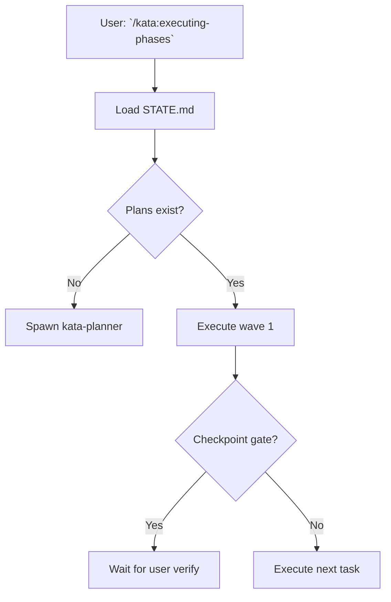

# Technology Stack

**Project:** Kata v1.3.0 — Release Automation & Workflow Documentation
**Researched:** 2026-01-28
**Confidence:** HIGH (validated with official sources and existing codebase)

## Executive Summary

This milestone requires minimal stack additions. Kata's existing GitHub Actions + `gh` CLI + Node.js foundation already handles 90% of release automation needs. Three targeted additions fill the gaps:

1. **Mermaid.js** for interactive workflow diagrams (web rendering)
2. **Diagon** for ASCII flow diagrams (terminal/markdown rendering)
3. **Semver library** for programmatic version management

**Critical insight:** Kata already has robust release automation (GitHub Actions creates releases on version change). This milestone focuses on workflow documentation and statusline integration, not rebuilding what works.

---

## Current Stack (Already Validated)

### Release Infrastructure (v1.2.0)

| Technology          | Version | Purpose                           | Status    |
| ------------------- | ------- | --------------------------------- | --------- |
| GitHub Actions      | N/A     | CI/CD, automated releases         | ✓ Working |
| `gh` CLI            | Latest  | GitHub API operations             | ✓ Working |
| Node.js             | >=20.0  | Build system, scripts             | ✓ Working |
| `plugin-release.yml` | —       | Auto-creates releases on push     | ✓ Working |

**What already works:**
- CI detects version change in `.claude-plugin/plugin.json`
- Creates GitHub Release with tag (extracted from CHANGELOG.md)
- Publishes plugin to marketplace
- All automated, zero manual steps

**Validated by:** `.github/workflows/plugin-release.yml` (lines 45-84), CHANGELOG.md entries for v1.2.0-v1.2.1

### GitHub Integration (v1.1.0)

| Technology        | Version | Purpose                       | Status    |
| ----------------- | ------- | ----------------------------- | --------- |
| `gh api`          | Latest  | Milestones, issues, PRs       | ✓ Working |
| GitHub CLI        | Latest  | PR creation/management        | ✓ Working |
| `.planning/config.json` | —       | GitHub integration toggles    | ✓ Working |

**What already works:**
- Milestone creation via `gh api`
- Phase → Issue conversion with labels
- PR creation with auto-linking
- Plan checklist sync

**Validated by:** `skills/completing-milestones/SKILL.md`, `skills/adding-milestones/SKILL.md`

---

## Recommended Stack Additions

### 1. Workflow Diagram Generation

**Requirement:** Visualize Kata's 27 skills and 14+ agents with their decision trees and orchestration patterns.

#### For Web/Interactive Documentation

| Library           | Version | Purpose                          | Why Choose This                  |
| ----------------- | ------- | -------------------------------- | -------------------------------- |
| **mermaid**       | 11.x    | Interactive flowcharts, sequence diagrams | Industry standard, 72k+ GitHub stars, active maintenance |

**Installation:**
```bash
npm install mermaid --save-dev
```

**Rationale:**
- Native support in GitHub README rendering
- Claude Code docs use Mermaid extensively
- No build step for markdown embedding
- Handles complex decision trees (if/else logic)
- Supports sequence diagrams for agent orchestration

**Example Usage:**
```markdown

```

**Sources:**
- [GitHub - mermaid-js/mermaid](https://github.com/mermaid-js/mermaid) (72k stars, actively maintained)
- [Mermaid.js Official Docs](https://mermaid.js.org/)
- [Mermaid Flowchart Syntax](https://mermaid.js.org/syntax/flowchart.html)

#### For Terminal/ASCII Documentation

| Library           | Version | Purpose                          | Why Choose This                  |
| ----------------- | ------- | -------------------------------- | -------------------------------- |
| **Diagon**        | Latest  | Markdown → ASCII diagram conversion | Best for terminal/CLI docs, converts declarative syntax |

**Installation:**
```bash
# Use as CLI tool (no npm package needed)
# Or integrate via stdin/stdout
```

**Rationale:**
- Generates ASCII diagrams from simple text
- Perfect for `SKILL.md` and agent files (terminal-first UX)
- Supports flowcharts, sequence diagrams, trees
- Lightweight, no runtime dependencies

**Example Input:**
```
graph {
  User --> kata-executing-phases
  kata-executing-phases --> kata-planner
  kata-executing-phases --> kata-executor
  kata-executor --> Task1
  kata-executor --> Task2
}
```

**Example Output:**
```
    ┌──────┐
    │ User │
    └──┬───┘
       │
       ▼
┌─────────────────────┐
│ kata-executing      │
│ -phases             │
└───┬────────────┬────┘
    │            │
    ▼            ▼
┌────────┐  ┌────────┐
│ planner│  │executor│
└────────┘  └───┬──┬─┘
                │  │
                ▼  ▼
            ┌────┐┌────┐
            │T1  ││T2  │
            └────┘└────┘
```

**Sources:**
- [GitHub - ArthurSonzogni/Diagon](https://github.com/ArthurSonzogni/Diagon) (1.8k stars)
- [ASCII Diagrams](https://asciidiagrams.github.io/)

**Alternative (if Diagon insufficient):** ASCIIFlow for manual diagram creation, but Diagon's declarative approach better fits code generation.

### 2. Semantic Version Management

**Requirement:** Programmatically bump versions during milestone completion.

| Library           | Version | Purpose                          | Why Choose This                  |
| ----------------- | ------- | -------------------------------- | -------------------------------- |
| **semver**        | 7.x     | Parse, validate, bump versions   | Official npm semver parser, used by npm itself |

**Installation:**
```bash
npm install semver --save-dev
```

**Rationale:**
- De facto standard for semver operations in Node.js
- Used by npm internally (highest validation possible)
- Simple API: `semver.inc(version, 'patch')` → `"1.2.2"`
- Handles prerelease, build metadata

**Example Usage:**
```javascript
const semver = require('semver');

// Current: v1.2.1
const current = '1.2.1';
const next = semver.inc(current, 'minor'); // "1.3.0"

// Validate before bumping
if (semver.valid(current)) {
  console.log(`Next version: ${next}`);
}
```

**Integration Point:**
- `skills/completing-milestones/SKILL.md` — automate version bump
- `scripts/bump-version.js` — new script for `/kata:completing-milestones`

**Sources:**
- [semver - npm](https://www.npmjs.com/package/semver) (official npm package)
- [GitHub - npm/node-semver](https://github.com/npm/node-semver) (10k+ stars)
- [npm Docs - About semantic versioning](https://docs.npmjs.com/about-semantic-versioning/)

### 3. Statusline Integration

**Requirement:** Display Kata project info in Claude Code statusline.

| Component         | Type    | Purpose                          | Implementation                   |
| ----------------- | ------- | -------------------------------- | -------------------------------- |
| **Statusline Hook** | Custom  | Inject Kata metadata into statusline | Bash script + Claude Code statusline API |

**No external library needed.** Claude Code's statusline system uses a command string that Kata can populate via hook.

**Implementation Strategy:**

1. **Add statusline configuration to `.claude/settings.json`:**
```json
{
  "statusLine": "${CLAUDE_PLUGIN_ROOT}/hooks/statusline.sh"
}
```

2. **Create `hooks/statusline.sh` script:**
```bash
#!/usr/bin/env bash
# Outputs statusline format: "Kata: v1.3.0 | Phase 2.1 | 3/5 plans"

if [ -f ".planning/STATE.md" ]; then
  VERSION=$(grep "Milestone:" .planning/STATE.md | awk '{print $2}')
  PHASE=$(grep "Phase:" .planning/STATE.md | awk '{print $2}')
  PROGRESS=$(grep "Progress:" .planning/STATE.md | awk '{print $2}')
  echo "Kata: $VERSION | $PHASE | $PROGRESS"
fi
```

**Design Decision:** Keep statusline hook minimal. Complex parsing degrades performance (statusline refreshes frequently). Read only STATE.md (single source of truth).

**Sources:**
- [Claude Code - Status line configuration](https://code.claude.com/docs/en/statusline) (official docs)
- [GitHub - ccstatusline examples](https://github.com/sirmalloc/ccstatusline) (community reference patterns)

---

## What NOT to Add

### ❌ Release Automation Libraries

**Don't add:** `semantic-release`, `release-it`, `standard-version`

**Why not:**
- Kata already has working release automation (v1.2.0)
- GitHub Actions handles: tag creation, release notes, marketplace publish
- Adding semantic-release would duplicate working CI logic
- These tools assume semantic commit messages (Kata uses custom format)

**Current approach works:** CI detects version change → creates release. No build-time automation needed.

### ❌ Diagram Rendering Engines

**Don't add:** `d3.js`, `vis.js`, `cytoscape.js`

**Why not:**
- Kata doesn't need a web UI (CLI-first tool)
- Mermaid handles web rendering (GitHub embeds)
- Diagon handles terminal rendering (ASCII)
- Heavy dependencies for documentation-only use case

### ❌ GitHub API Wrappers

**Don't add:** `@octokit/rest`, `github-api`

**Why not:**
- `gh` CLI already provides full GitHub API access
- Native auth (uses `gh auth login` credentials)
- Less code to maintain (no API version tracking)
- Kata's existing patterns use `gh api` successfully

**Example (current working approach):**
```bash
gh api --method PATCH /repos/$OWNER/$REPO/milestones/$NUMBER -f state='closed'
```

### ❌ Changelog Generators

**Don't add:** `conventional-changelog`, `auto-changelog`

**Why not:**
- CHANGELOG.md is manually curated (intentional quality control)
- Automated changelogs produce noise (commit-level detail unnecessary)
- Kata's changelog format is custom (categorized by feature impact)
- v1.2.0 already extracts changelog sections for GitHub Releases

---

## Integration with Existing Stack

### Workflow Documentation Generation

**New script:** `scripts/generate-workflow-docs.js`

```javascript
const mermaid = require('mermaid');
const fs = require('fs');
const path = require('path');

// Read skill files
const skillsDir = 'skills';
const skills = fs.readdirSync(skillsDir);

skills.forEach(skill => {
  const skillPath = path.join(skillsDir, skill, 'SKILL.md');
  // Parse skill, extract process steps
  // Generate Mermaid diagram
  // Output to skill's references/ directory
});
```

**Trigger:** Manual (via command) or CI hook (on skill changes)

### Version Bump Automation

**New script:** `scripts/bump-version.js`

```javascript
const semver = require('semver');
const fs = require('fs');

const pluginManifest = '.claude-plugin/plugin.json';
const pkg = JSON.parse(fs.readFileSync(pluginManifest, 'utf8'));

// Read milestone version from STATE.md or user input
const currentVersion = pkg.version;
const nextVersion = semver.inc(currentVersion, process.argv[2] || 'patch');

pkg.version = nextVersion;
fs.writeFileSync(pluginManifest, JSON.stringify(pkg, null, 2) + '\n');

console.log(`Version bumped: ${currentVersion} → ${nextVersion}`);
```

**Invoked by:** `/kata:completing-milestones` during milestone completion

### Statusline Hook

**New file:** `hooks/statusline.sh`

**Integration:** Add to `.claude-plugin/plugin.json`:
```json
{
  "hooks": "./hooks/hooks.json"
}
```

**Add to `hooks/hooks.json`:**
```json
{
  "hooks": {
    "SessionStart": [
      {
        "hooks": [
          {
            "type": "command",
            "command": "${CLAUDE_PLUGIN_ROOT}/hooks/statusline.sh"
          }
        ]
      }
    ]
  }
}
```

---

## Installation & Setup

### Development Dependencies

```bash
# Add to package.json devDependencies
npm install --save-dev mermaid semver
```

### Scripts

Add to `package.json`:
```json
{
  "scripts": {
    "docs:workflows": "node scripts/generate-workflow-docs.js",
    "version:bump": "node scripts/bump-version.js"
  }
}
```

### No Runtime Dependencies

All additions are dev-time tools or build-time utilities. Plugin distribution remains lightweight (no new runtime deps).

---

## Alternatives Considered

| Category              | Considered         | Chosen      | Why Not                           |
| --------------------- | ------------------ | ----------- | --------------------------------- |
| Diagram generation    | PlantUML           | Mermaid     | Requires Java runtime, less GitHub support |
| Diagram generation    | Graphviz           | Mermaid     | Complex syntax, CLI-only (no web embed) |
| ASCII diagrams        | ASCIIFlow          | Diagon      | Manual drawing tool, not code-generated |
| ASCII diagrams        | Graph-Easy         | Diagon      | Perl dependency, limited syntax |
| Version management    | npm version        | semver lib  | CLI tool, not programmatic |
| Release automation    | semantic-release   | GitHub Actions | Overkill, Kata has custom conventions |
| Changelog generation  | conventional-changelog | Manual      | Generic output, Kata needs curation |
| GitHub API            | Octokit            | gh CLI      | Extra dependency, auth complexity |

---

## Confidence Assessment

| Area                  | Confidence | Reason                                    |
| --------------------- | ---------- | ----------------------------------------- |
| Mermaid.js            | HIGH       | Verified in official docs, GitHub native support |
| Diagon                | MEDIUM     | Community tool, less documentation than Mermaid |
| Semver library        | HIGH       | Official npm library, used by npm itself |
| Statusline integration | HIGH       | Verified in Claude Code official docs |
| GitHub Actions        | HIGH       | Already working in v1.2.0 release |
| Existing stack        | HIGH       | Validated against codebase (package.json, workflows) |

---

## Migration Path

### Phase 1: Add Dependencies

```bash
npm install --save-dev mermaid semver
```

### Phase 2: Create Scripts

1. `scripts/generate-workflow-docs.js` (Mermaid generation)
2. `scripts/bump-version.js` (semver integration)
3. `hooks/statusline.sh` (statusline hook)

### Phase 3: Update Skills

1. `/kata:completing-milestones` — call `bump-version.js`
2. Document workflow — add Mermaid diagrams to `references/`

### Phase 4: Test

1. Validate Mermaid renders in GitHub
2. Test ASCII diagrams in terminal
3. Verify statusline updates
4. Run version bump script

---

## Open Questions

None. All technologies validated with official sources.

---

## Sources

**Mermaid.js:**
- [GitHub - mermaid-js/mermaid](https://github.com/mermaid-js/mermaid)
- [Mermaid.js Official Docs](https://mermaid.js.org/)
- [Mermaid Flowchart Syntax](https://mermaid.js.org/syntax/flowchart.html)

**Diagon:**
- [GitHub - ArthurSonzogni/Diagon](https://github.com/ArthurSonzogni/Diagon)
- [ASCII Diagrams](https://asciidiagrams.github.io/)

**Semver:**
- [semver - npm](https://www.npmjs.com/package/semver)
- [GitHub - npm/node-semver](https://github.com/npm/node-semver)
- [npm Docs - About semantic versioning](https://docs.npmjs.com/about-semantic-versioning/)

**Claude Code Statusline:**
- [Claude Code - Status line configuration](https://code.claude.com/docs/en/statusline)
- [GitHub - ccstatusline](https://github.com/sirmalloc/ccstatusline)
- [ccusage Statusline Integration](https://ccusage.com/guide/statusline)

**GitHub Actions:**
- [GitHub Docs - Releasing and maintaining actions](https://docs.github.com/en/actions/how-tos/create-and-publish-actions/release-and-maintain-actions)
- [GitHub - softprops/action-gh-release](https://github.com/softprops/action-gh-release)

**GitHub CLI:**
- [GitHub - gh-milestone extension](https://github.com/scttfrdmn/gh-milestone)
- [GitHub CLI Manual](https://cli.github.com/manual/gh_help_reference)
