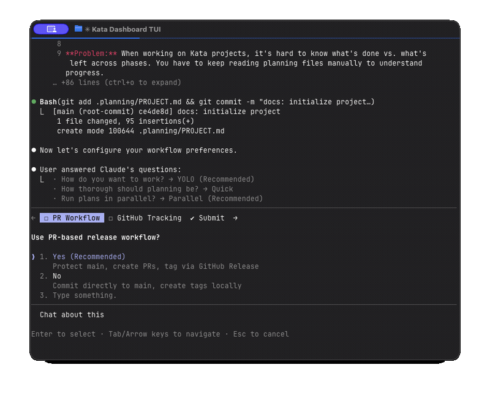

<div align="center">

# Kata Orchestrator

**型** · /ˈkɑːtɑː/ · *noun* - a choreographed pattern practiced repeatedly until perfected

**Multi-agent orchestration framework for spec-driven development.**


<br>
[kata.sh](https://kata.sh)

[](https://github.com/gannonh/kata-marketplace)

</div>

## Install

**Claude Code plugin (recommended):**
```bash
/plugin marketplace add gannonh/kata-marketplace
/plugin install kata@gannonh-kata-marketplace
```

**Agent Skills (skills.sh):**
```bash
npx skills add gannonh/kata-skills
```

---

## What's New in v1.12.0

**Codebase Intelligence** — Agents now understand your project's architecture and conventions:
- **Full pipeline** — `scan-codebase.cjs` → `generate-intel.js` → `.planning/intel/` → agent context injection
- **Context-aware agents** — Planners, executors, and verifiers receive codebase conventions and architecture summaries at spawn time
- **Greenfield scaffolding** — Intel bootstrapped at project creation via `scaffold-intel.cjs` in kata-new-project
- **Brownfield auto-refresh** — Staleness detection triggers mapper agent when 30%+ of source files change since last scan
- **Smart scan gate** — Unified decision tree in execute-phase step 7.25, `SCAN_RAN` guard prevents redundant regeneration
- **v2 intel schema** — `generate-intel.js` emits camelCase stats with commitHash freshness metadata

<details>
<summary><strong>v1.11.0: Phase-Level Worktrees</strong></summary>

**Phase-Level Worktrees** — `main/` stays on the main branch permanently:
- **Workspace architecture** — Persistent `workspace/` as working directory, `main/` as read-only reference
- **Phase worktrees** — Phase execution creates a worktree instead of switching `main/` off main
- **Two-tier model** — Plan worktrees fork from phase branch, merge back to phase worktree
- **Worktree-safe merges** — All merge patterns updated to work with bare repo layout

</details>

<details>
<summary><strong>v1.10.0: Git Worktree Support</strong></summary>

**Optional plan-level agent isolation during phase execution:**
- **Config foundation** — `worktree.enabled` setting with `read-config.sh` for nested JSON keys
- **Worktree lifecycle** — `manage-worktree.sh` creates isolated worktrees per plan, merges after wave completion
- **Wave-based execution** — Each plan agent gets its own branch and working directory
- **Graceful fallback** — When disabled (default), execution uses shared-directory model

</details>

<details>
<summary><strong>v1.9.0: Template Overrides (Universal)</strong></summary>

**Customize how Kata generates planning artifacts:**
- **Template customization** — `/kata-customize` to list, copy, edit, and validate template overrides
- **Universal resolution** — Templates resolve via sibling discovery, working identically for plugin and skills-only users
- **Schema validation** — Required field checks run as pre-flight in skills (no SessionStart hooks)
- **5 customizable templates** — Plans, summaries, UAT sessions, verification reports, changelogs

</details>

<details>
<summary><strong>v1.8.0: Adaptive Workflows</strong></summary>

**Adaptive Workflows** — Project-specific preferences, template overrides, and config-driven workflow variants:
- **Progressive capture** — Reduced onboarding to 5 essential questions, deferred preferences captured at first use
- **Template overrides** — Extract inline templates to standalone files at `.planning/templates/`
- **Config workflow variants** — Per-skill configuration keys in `workflows` section
- **`/kata-doctor`** — Project health checks including roadmap format validation
- **Config validator** — SessionStart hook warns on unknown keys, errors on invalid types
- **Template drift detection** — Detects when project templates diverge from plugin schema

</details>

<details>
<summary><strong>v1.7.0: Brainstorm Integration</strong></summary>

**Structured explorer/challenger ideation wired into workflows:**
- **`/kata-brainstorm`** — Paired agent teams debate ideas, producing pressure-tested proposals
- **Optional workflow gates** — Brainstorm offered in add-milestone, new-project, discuss-phase, research-phase, and plan-phase
- **Context injection** — Brainstorm output auto-feeds into planner and researcher agents
- **Agent Teams prerequisite** — Auto-detects and enables `CLAUDE_CODE_EXPERIMENTAL_AGENT_TEAMS`

</details>

<details>
<summary><strong>v1.6.0: Skills-Native Subagents</strong></summary>

**Portable across Agent Skills-compatible platforms:**
- Dual install: Plugin marketplace or `npx skills add gannonh/kata-skills`
- All 19 custom agent types replaced with `general-purpose` (Agent Skills spec)
- Agent instructions bundled in skill `references/`, inlined at spawn time

</details>

<details>
<summary><strong>v1.5.0: Phase Management</strong></summary>

**Reorganize your roadmap without starting over:**
- **Move phases** — `/kata-move-phase 3 to v2.0` moves a phase between milestones
- **Reorder phases** — `/kata-move-phase 3 before 1` changes phase order within a milestone
- **Global phase numbering** — Phase numbers are globally sequential across milestones (they never reset)
- **Phase state directories** — Phases organized into `pending/`, `active/`, `completed/`

</details>

<details>
<summary><strong>v1.4.1: Issue Execution</strong></summary>

**Complete Issue Lifecycle** — From creation to automatic closure:
- Execution modes: "Work on it now" offers quick task or planned execution
- PR auto-closure: Phase, milestone, and issue execution PRs include `Closes #X`
- Roadmap integration: Pull backlog issues into milestones and phases
- Source traceability: Issues flow through plans to PRs with automatic closure chain

</details>

<details>
<summary><strong>v1.4.0: GitHub Issue Sync</strong></summary>

**Bidirectional Issue Integration** — Issues sync between Kata and GitHub:
- Create issues locally, auto-sync to GitHub with `backlog` label
- Pull existing GitHub Issues for selection and execution
- In-progress label sync and self-assignment on work start

</details>

<details>
<summary><strong>v1.3.0: Release Automation</strong></summary>

**Release Workflow** — Integrated into milestone completion:
- Changelog generation from conventional commits
- Semantic version detection (feat → minor, fix → patch)
- Dry-run mode, review gate, GitHub Release creation

</details>

**All features are optional.** Enable what you need via `/kata-configure-settings`.

<p align="center">

</p>

---

## Voice-First: Conversational Interface

Drive your entire workflow with **natural language**.

| You say...                 | Kata does...                                          |
| -------------------------- | ----------------------------------------------------- |
| "Start a new project"      | Deep questioning → PROJECT.md + config                |
| "Add the first milestone"  | Research → Requirements → Roadmap → GitHub Milestone  |
| "Let's discuss phase 1"    | Identifies gray areas → Captures your decisions       |
| "Plan phase 1"             | Research → Plans → Verification loop                  |
| "Execute the phase"        | Parallel agents → Commits → PR (optional)             |
| "Verify the work"          | UAT testing → Debug agents if issues found            |
| "Review my PR"             | 6 specialized review agents                           |
| "Let's brainstorm"         | Explorer/challenger teams → Pressure-tested proposals |
| "Complete the milestone"   | Archive → Tag/Release                                 |
| "Move phase 3 to v2.0"     | Cross-milestone move → Renumber → Commit              |
| "Reorder phase 3 before 1" | Reorder → Renumber all affected → Commit              |
| "Check project health"     | Roadmap format validation → Config checks             |
| "What's the status?"       | Progress report → Routes to next action               |

Slash commands exist for precision (`/kata-plan-phase 2`), but natural language always works.

---

## Getting Started

### Install

**Claude Code plugin:**
```bash
/plugin marketplace add gannonh/kata-marketplace
/plugin install kata@gannonh-kata-marketplace
```

**Agent Skills (skills.sh):**
```bash
npx skills add gannonh/kata-skills
```

Verify with `/kata-help`.

### Update

```bash
claude plugin update kata@gannonh-kata-marketplace
```

Check what's new: `/kata-whats-new`

### Recommended: Skip Permissions

Kata is designed for automation. For best experience:

```bash
claude --dangerously-skip-permissions
```

<details>
<summary><strong>Alternative: Granular Permissions</strong></summary>

Add to `.claude/settings.json`:

```json
{
  "permissions": {
    "allow": [
      "Bash(git:*)", "Bash(gh:*)", "Bash(npm:*)",
      "Bash(cat:*)", "Bash(ls:*)", "Bash(mkdir:*)"
    ]
  }
}
```

</details>

---

## How It Works

### 1. Initialize Project

```
"Start a new project"
```

Creates the foundation through deep questioning:

1. **Questions** — Probes until it understands your vision (goals, constraints, tech, edge cases)
2. **Configuration** — Sets workflow preferences (mode, agents, GitHub integration)

**Creates:** `PROJECT.md`, `config.json`

**Next:** "Add the first milestone"

> **Have existing code?** Kata detects it and offers to map your codebase first. Spawns parallel agents to analyze stack, architecture, and conventions.

---

### 2. Add Milestone

```
"Add milestone v1.0"
```

Defines what you're building this cycle:

1. **Research** (optional) — 4 parallel agents investigate domain: Stack, Features, Architecture, Pitfalls
2. **Requirements** — Extracts v1 scope with traceability IDs (AUTH-01, API-02)
3. **Roadmap** — Creates phases mapped to requirements
4. **GitHub Milestone** (optional) — Creates milestone + phase issues if enabled

**Creates:** `REQUIREMENTS.md`, `ROADMAP.md`, `STATE.md`, `research/` (optional)

**Next:** "Plan phase 1" or "Discuss phase 1"

---

### 3. Discuss Phase (Optional)

```
"Let's discuss phase 1"
```

**Use when the phase goal is ambiguous.** Captures your implementation preferences before planning.

The system analyzes the phase and identifies domain-specific gray areas:
- **Visual features** → Layout, density, interactions, empty states
- **APIs** → Response format, error handling, versioning
- **Data systems** → Structure, validation, migrations

For each area you select, it probes until satisfied. Output feeds directly into planning.

**Creates:** `{phase}-CONTEXT.md`

**Skip if:** Phase goal is clear and unambiguous.

---

### 4. Plan Phase

```
"Plan phase 1"
```

Creates executable plans through research and verification:

1. **Research** — Investigates how to implement this phase
2. **Planning** — Creates 2-5 atomic PLAN.md files with XML task structure
3. **Verification** — Plan checker confirms plans achieve phase goals (loops until pass)
4. **GitHub Update** — Adds plan checklist to phase issue (if enabled)

**Creates:** `{phase}-RESEARCH.md`, `{phase}-01-PLAN.md`, `{phase}-02-PLAN.md`, ...

**Flags:**
- `--skip-research` — Skip research, plan directly
- `--skip-verify` — Skip plan checker loop
- `--gaps` — Create fix plans from failed verification

---

### 5. Execute Phase

```
"Execute phase 1"
```

Runs plans with fresh context per agent:

1. **Branch** — Creates `feat/v1.0-1-foundation` (if PR workflow enabled)
2. **Waves** — Groups plans by dependency, runs parallel within each wave
3. **Commits** — Atomic commit per task with conventional format
4. **GitHub Updates** — Checks off plans in issue as they complete
5. **Verification** — Confirms phase goal achieved
6. **PR** — Marks ready, links with "Closes #X" (if enabled)

**Creates:** `{phase}-SUMMARY.md` per plan, `{phase}-VERIFICATION.md`

Walk away, come back to completed work with clean git history.

---

### 6. Verify Work (Optional UAT)

```
"Verify phase 1"
```

**Manual testing with intelligent assistance.** The system:

1. Extracts testable deliverables from summaries
2. Walks you through each one: "Can you log in with email?"
3. On failures: Spawns debug agents → Creates fix plans → Executes fixes

**Creates:** `{phase}-UAT.md`, fix plans if issues found

**Skip if:** Automated verification passed and you trust it.

---

### 7. Review PR (Optional)

```
"Review my PR"
```

Runs 6 specialized review agents in parallel:

| Agent            | Focus                                 |
| ---------------- | ------------------------------------- |
| Code Reviewer    | General quality, CLAUDE.md compliance |
| Test Analyzer    | Coverage gaps, edge cases             |
| Comment Analyzer | Documentation accuracy                |
| Failure Finder   | Error handling, silent failures       |
| Type Analyzer    | Type design, invariants               |
| Code Simplifier  | Clarity, maintainability              |

**Output:** Aggregated findings by severity (Critical → Important → Suggestions)

Offered automatically after phase execution or run on-demand anytime.

---

### 8. Complete Milestone

```
"Complete the milestone"
```

Archives and ships, with optional release automation:

1. **Verify** — All phases have summaries, optional audit passed
2. **Release Workflow** (optional, v1.3.0+) — Offered before archiving:
   - Detects version bump from conventional commits (feat → minor, fix → patch, breaking → major)
   - Generates changelog entry from commit history (Keep a Changelog format)
   - Preview mode lets you review before applying
   - Human confirmation before writing to files
3. **Archive** — Moves milestone to `milestones/v1.0-ROADMAP.md`
4. **Update** — PROJECT.md gets "Current State" section
5. **Release** — Creates PR or tag based on workflow setting
6. **CI** — GitHub Release created automatically on merge

**Creates:** Archived roadmap/requirements, updated CHANGELOG.md (if release), git tag or release PR

**Next:** "Add milestone v1.1"

---

### Quick Mode

```
"Quick task: fix the login bug"
```

For ad-hoc work that doesn't need full planning:

- Same agents, same quality
- Skips research, plan checker, verifier
- Separate tracking in `.planning/quick/`

**Use for:** Bug fixes, config changes, small features, one-off tasks.

---

## Configuration

Settings live in `.planning/config.json`. Configure during project init or update anytime:

```
/kata-configure-settings
```

### Core Settings

| Setting | Options                              | Default    | What it controls                  |
| ------- | ------------------------------------ | ---------- | --------------------------------- |
| `mode`  | `yolo`, `interactive`                | `yolo`     | Auto-approve vs confirm each step |
| `depth` | `quick`, `standard`, `comprehensive` | `standard` | Planning thoroughness             |

### Model Profiles

Balance quality vs cost:

| Profile    | Planning | Execution | Verification |
| ---------- | -------- | --------- | ------------ |
| `quality`  | Opus     | Opus      | Sonnet       |
| `balanced` | Opus     | Sonnet    | Sonnet       |
| `budget`   | Sonnet   | Sonnet    | Haiku        |

Switch: `/kata-set-profile quality`

### Workflow Agents

Toggle agents that run during planning/execution:

| Setting               | Default | What it does                         |
| --------------------- | ------- | ------------------------------------ |
| `workflow.research`   | `true`  | Research domain before planning      |
| `workflow.plan_check` | `true`  | Verify plans achieve phase goals     |
| `workflow.verifier`   | `true`  | Confirm deliverables after execution |

Override per-invocation: `/kata-plan-phase --skip-research`

### GitHub Integration (Optional)

**All GitHub features are off by default.** Enable via `/kata-configure-settings`:

| Setting            | Options              | Default | What it enables                               |
| ------------------ | -------------------- | ------- | --------------------------------------------- |
| `pr_workflow`      | `true`/`false`       | `false` | Branch per phase, PRs, tag via GitHub Release |
| `github.enabled`   | `true`/`false`       | `false` | GitHub Milestones and Issues                  |
| `github.issue_mode` | `auto`/`ask`/`never` | `auto`  | When to create phase Issues                   |

**When both enabled:**

| Kata Action           | GitHub Result                              |
| --------------------- | ------------------------------------------ |
| Add milestone         | Creates GitHub Milestone                   |
| Add phases to roadmap | Creates Issues with `phase` label          |
| Plan phase            | Updates issue with plan checklist          |
| Execute phase         | Creates branch, draft PR, checks off plans |
| Phase complete        | Marks PR ready, links "Closes #X"          |
| Milestone complete    | Creates release PR                         |
| Merge to main         | CI creates GitHub Release + tag            |

**Requirements:** `gh` CLI authenticated, GitHub remote configured.

### Execution

| Setting       | Default | What it controls          |
| ------------- | ------- | ------------------------- |
| `commit_docs` | `true`  | Track `.planning/` in git |

---

## Template Customization

Templates control the structure of planning artifacts. Override any template to change how Kata generates files for your project.

### Available Templates

| Template                 | Skill                   | Controls                   |
| ------------------------ | ----------------------- | -------------------------- |
| `summary-template.md`    | kata-execute-phase      | Phase completion summaries |
| `plan-template.md`       | kata-plan-phase         | Phase plan structure       |
| `UAT-template.md`        | kata-verify-work        | UAT session format         |
| `verification-report.md` | kata-verify-work        | Verification report format |
| `changelog-entry.md`     | kata-complete-milestone | Changelog entry format     |

Overrides live at `.planning/templates/`. When a template override exists, Kata uses it instead of the built-in default.

### Customization Workflow

```
# List available templates and override status
/kata-customize list

# Copy a default template for local editing
/kata-customize copy summary-template.md

# Edit the override (describe changes in natural language)
/kata-customize edit summary-template.md

# Validate all overrides against required schemas
/kata-customize validate
```

### Validation

Template overrides are validated automatically during skill execution. If an override is missing required fields, you will see a drift warning. Run `/kata-customize validate` to check all overrides, or `/kata-doctor` for a full project health check.

For detailed schema documentation per template, see [Template Customization Reference](.docs/TEMPLATE-CUSTOMIZATION.md).

---

## Why It Works

### Context Engineering

Claude requires the right context to perform well. Kata manages it:

| File              | Purpose                                          |
| ----------------- | ------------------------------------------------ |
| `PROJECT.md`      | Vision, requirements, decisions — always loaded  |
| `research/`       | Domain knowledge (stack, architecture, pitfalls) |
| `REQUIREMENTS.md` | Scoped requirements with traceability            |
| `ROADMAP.md`      | Phase structure, what's done                     |
| `STATE.md`        | Living memory across sessions                    |
| `PLAN.md`         | Atomic executable task with verification         |
| `SUMMARY.md`      | What happened, committed to history              |
| `intel/summary.md`| Codebase conventions injected into agent context |

### Multi-Agent Orchestration

Skills are thin orchestrators that spawn `general-purpose` subagents with instructions inlined from their `references/` directory. All agents use the Agent Skills standard — no custom agent types.

| Stage        | Orchestrator     | Subagents                                        |
| ------------ | ---------------- | ------------------------------------------------ |
| Research     | Coordinates      | 4 parallel researchers → synthesizer             |
| Planning     | Validates, loops | Planner → checker (up to 3 iterations)           |
| Execution    | Groups waves     | Parallel executors, each with fresh 200k context |
| Verification | Routes           | Verifier → debuggers if failures                 |

**Result:** Run an entire phase and your main context stays at 30-40%.

### Atomic Commits

Each task gets its own commit:

```
abc123f feat(01-02): add email confirmation flow
def456g feat(01-02): implement password hashing
ghi789j feat(01-02): create registration endpoint
```

Git bisect finds exact failures. Each task independently revertable.

---

## Artifact Structure

```
.planning/
├── PROJECT.md              # Project vision and requirements
├── config.json             # Workflow configuration
├── templates/              # Template overrides (customized output formats)
├── ROADMAP.md              # Phase structure
├── REQUIREMENTS.md         # Scoped requirements with IDs
├── STATE.md                # Living memory
├── research/               # Domain research (optional)
│   ├── STACK.md
│   ├── FEATURES.md
│   ├── ARCHITECTURE.md
│   ├── PITFALLS.md
│   └── SUMMARY.md
├── phases/
│   ├── pending/               # Planned phases not yet started
│   ├── active/                # Phase currently being executed
│   │   └── 01-foundation/
│   │       ├── 01-CONTEXT.md       # Implementation decisions
│   │       ├── 01-RESEARCH.md      # Phase research
│   │       ├── 01-01-PLAN.md       # Executable plan
│   │       ├── 01-01-SUMMARY.md    # Execution summary
│   │       ├── 01-VERIFICATION.md  # Goal verification
│   │       └── 01-UAT.md           # User acceptance tests
│   └── completed/             # Verified phases
├── intel/                  # Codebase intelligence (auto-generated)
│   ├── index.json          # File registry (exports, imports, types, layers)
│   ├── conventions.json    # Detected naming and directory patterns
│   └── summary.md          # Compressed agent-readable summary (~80-150 lines)
├── quick/                  # Ad-hoc tasks
│   └── 001-fix-bug/
├── milestones/             # Archived milestones
│   ├── v1.0-ROADMAP.md
│   └── v1.0-REQUIREMENTS.md
└── issues/                 # Backlog issues
```

---

## Development Installation

<details>
<summary><strong>Build from source</strong></summary>

```bash
git clone https://github.com/gannonh/kata.git
cd kata
npm run build:plugin

# Test locally
claude --plugin-dir ./dist/plugin
```

</details>

---

## Understanding Kata

Visual and conceptual guides for how Kata works:

- **[Workflow Diagrams](.docs/diagrams/FLOWS.md)** — Mermaid flowcharts of orchestration, lifecycle, planning, execution, verification, and PR workflows
- **[Terminology Glossary](.docs/glossary/GLOSSARY.md)** — Definitions and relationships between all Kata concepts

## Background

Kata began as a fork of [GSD](https://github.com/glittercowboy/get-shit-done), then became a hard fork:

- **Team-oriented** — GSD optimizes for solo devs. Kata adds GitHub integration, PR workflows, and collaborative features.
- **Skills-based** — Built on the [Agent Skills](https://agentskills.io) open standard. Portable across any Agent Skills-compatible platform.
- **Dual distribution** — Available via Claude Code plugin marketplace and [skills.sh](https://skills.sh).

---

## License

MIT License. See [LICENSE](LICENSE).

---

<div align="center">

**Kata adds structure to Claude Code.**

*Tell it what you want. Track progress in GitHub (optionally).*

</div>
