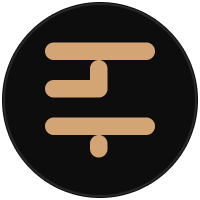

<div align="center">

# Kata

**型** · /ˈkɑːtɑː/ · *noun* - a choreographed pattern practiced repeatedly until perfected


<br>
[kata.sh](https://kata.sh)

</div>

---

## Kata Monorepo

This is the Kata monorepo for five AI agent products:

- Kata CLI in `apps/cli`
- Kata Symphony in `apps/symphony`
- Kata Desktop in `apps/electron`
- Kata Orchestrator in `apps/orchestrator`
- Kata Context in `apps/context`

The repo also contains shared packages that support the product apps.

## Products

| Product                                          | Path                | Use it for                                                                                   | Quick start                                                 |
| ------------------------------------------------ | ------------------- | -------------------------------------------------------------------------------------------- | ----------------------------------------------------------- |
| [Kata CLI](apps/cli/README.md)                   | `apps/cli`          | Terminal-based coding work with guided and autonomous execution modes                        | `npx @kata-sh/cli`                                          |
| [Kata Symphony](apps/symphony/README.md)         | `apps/symphony`     | Headless orchestrator: polls Linear, dispatches parallel agent sessions, manages full PR lifecycle | `cargo build --release`                               |
| [Kata Desktop](apps/electron/README.md)          | `apps/electron`     | Desktop-based agent work with workspaces, session management, sources, and approval controls | [GitHub Releases](https://github.com/gannonh/kata/releases) |
| [Kata Orchestrator](apps/orchestrator/README.md) | `apps/orchestrator` | Spec-driven workflows for Claude Code, OpenCode, Gemini CLI, and Codex                       | `npx @kata-sh/orc@latest`                                   |
| Kata Context                                     | `apps/context`      | Structural, semantic, and memory-based codebase understanding for AI coding agents           | `npx @kata/context`                                         |

## Kata CLI

Kata CLI is a terminal coding agent. It breaks work into milestones, slices, and tasks, then executes with structured planning, verification, and fresh context windows. It supports stepwise operation, autonomous execution, and a two-terminal steering workflow.

Quick start:

```bash
npx @kata-sh/cli
```

Or install globally:

```bash
npm install -g @kata-sh/cli
kata-cli
```

Use Kata CLI when you want:

- a terminal-first workflow
- direct repo access from the command line
- guided or autonomous execution inside one tool

Read more in [apps/cli/README.md](apps/cli/README.md).

## Kata Symphony

Kata Symphony is a headless orchestrator that polls a Linear project for candidate issues and dispatches parallel agent sessions to work on them autonomously. It manages the full ticket lifecycle — from Todo through implementation, PR creation, automated code review, human review, and merge — with multi-turn sessions, real-time event streaming, and a live HTTP dashboard.

Quick start:

```bash
cd apps/symphony
cargo build --release

# Create a WORKFLOW.md with your Linear project config and agent prompt
# (see apps/symphony/docs/WORKFLOW-REFERENCE.md for all settings)

LINEAR_API_KEY=lin_api_... ./target/release/symphony WORKFLOW.md --port 8080
```

Key features:

- **Linear integration** — polls for issues, manages state transitions, respects priorities and dependency graphs
- **Parallel agents** — configurable concurrency with per-state slot limits
- **Multi-turn sessions** — agents continue on the same Codex thread across turns, preserving conversation history
- **Full PR lifecycle** — agents create PRs, address review feedback, resolve comment threads, and merge
- **Real-time streaming** — events flow from workers to the orchestrator as they happen
- **Dynamic config reload** — WORKFLOW.md changes take effect without restart
- **SSH worker pools** — distribute sessions across remote machines
- **HTTP dashboard + JSON API** — live observability at `localhost:8080`

Use Kata Symphony when you want:

- autonomous ticket-to-merge execution without human intervention
- parallel agent sessions working through a Linear backlog
- a headless orchestrator you can run on a server or CI

Read more in [apps/symphony/README.md](apps/symphony/README.md).

## Kata Desktop

Kata Desktop is a desktop app for working with AI agents across multiple sessions and workspaces. It includes Git context, permission modes, MCP integrations, external sources, background tasks, file attachments, and persistent session state.

Download a release from [GitHub Releases](https://github.com/gannonh/kata/releases), or run it from source:

```bash
bun install
bun run electron:start
```

Use Kata Desktop when you want:

- a desktop workspace for managing multiple agent sessions
- approval controls for read, edit, and autonomous actions
- connected sources such as MCP servers, REST APIs, and local files

Read more in [apps/electron/README.md](apps/electron/README.md).

## Kata Orchestrator

Kata Orchestrator provides a spec-driven development harness for supported terminal-based coding agents, including Claude Code, Codex, Gemini CLI, and OpenCode. It organizes work into discuss, plan, execute, and verify phases, runs execution in fresh subagent contexts, and writes project state to disk as structured files.

Quick start:

```bash
npx @kata-sh/orc@latest
```

Verify the install in your runtime:

```text
Claude Code / Gemini CLI: /kata:help
OpenCode: /kata-help
Codex: $kata-help
```

Use Kata Orchestrator when you want:

- a spec-driven workflow inside an existing coding runtime
- structured planning and verification across longer projects
- project artifacts written to disk instead of relying on one long session

Read more in [apps/orchestrator/README.md](apps/orchestrator/README.md).

## Kata Context

Kata Context provides structural, semantic, and memory-based codebase understanding for AI coding agents. It indexes source files using tree-sitter, builds a dependency graph stored in SQLite, and exposes commands for graph queries, grep, and file discovery.

```bash
npx @kata/context
```

| Path                | Purpose                                                    |
| ------------------- | ---------------------------------------------------------- |
| `apps/cli`          | Kata CLI                                                   |
| `apps/symphony`     | Kata Symphony (Rust)                                       |
| `apps/context`      | Kata Context                                               |
| `apps/electron`     | Kata Desktop                                               |
| `apps/orchestrator` | Kata Orchestrator                                          |
| `apps/online-docs`  | Documentation site (Fumadocs/Next.js)                      |
| `apps/viewer`       | Session viewer                                             |
| `packages/core`     | Shared types                                               |
| `packages/shared`   | Shared agent, auth, config, git, session, and source logic |
| `packages/ui`       | Shared UI components                                       |
| `packages/mermaid`  | Mermaid diagram renderer                                   |

## Local Development

Install dependencies:

```bash
bun install
```

Install repo-managed git hooks:

```bash
bun run githooks:install
```

Common commands:

| Command                              | Purpose                                        |
| ------------------------------------ | ---------------------------------------------- |
| `bun run validate`                   | Lint + typecheck + test all packages via Turbo  |
| `bun run validate:affected`          | Same, only changed packages                    |
| `bun run electron:dev`               | Start Kata Desktop in development mode         |
| `cd apps/symphony && cargo build`    | Build Kata Symphony                            |

## Testing

All testing is orchestrated by Turborepo. Each package owns its test runner.

| Command                    | Runs                                           |
| -------------------------- | ---------------------------------------------- |
| `bun run test`             | All package tests via Turborepo                |
| `bun run test:affected`    | Only changed packages                          |
| `bun run test:e2e`         | Desktop Playwright E2E (mocked)                |
| `bun run test:e2e:live`    | Desktop Playwright E2E (real accounts, local)  |

| Package      | Test runner | Notes                                     |
| ------------ | ----------- | ----------------------------------------- |
| context      | Vitest      | Uses better-sqlite3 (native Node addon)   |
| symphony     | cargo test  | Rust, runs through package.json shim      |
| all others   | Bun test    | Default for JS/TS packages                |

A pre-push git hook runs `turbo run lint typecheck test --affected` before every push.

## License

Kata CLI and Kata Orchestrator use MIT. Kata Desktop uses Apache 2.0.
