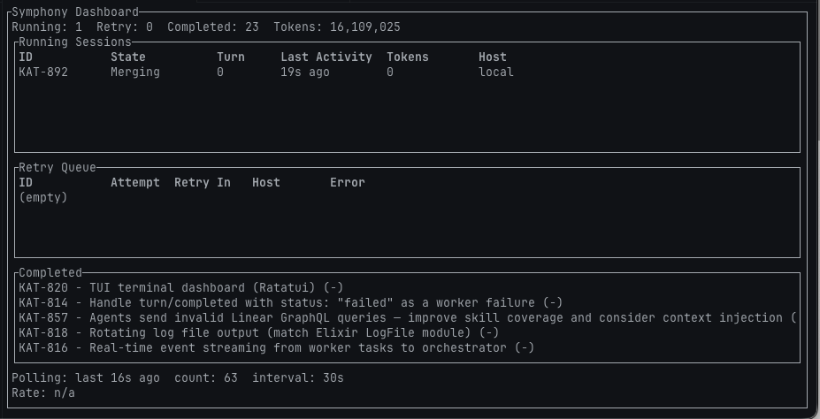
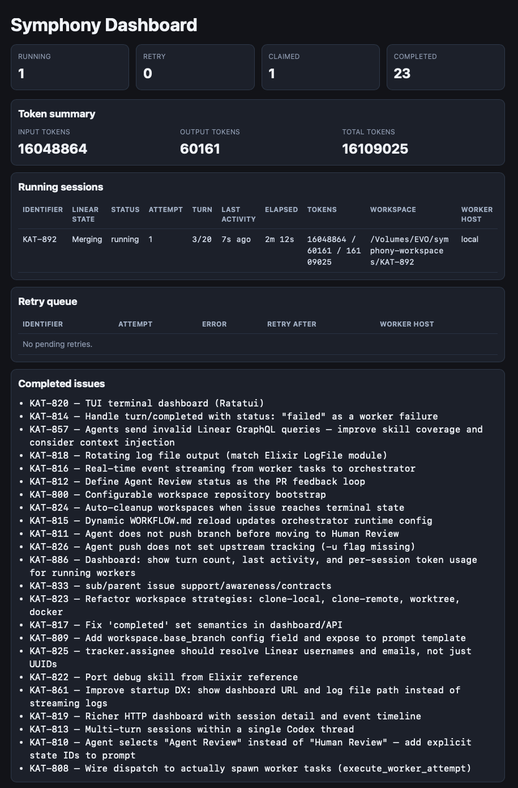

# Kata Symphony

Headless orchestrator that polls a Linear project for issues and dispatches parallel agent sessions to work on them. You run Symphony, point it at a Linear project, and it picks up tickets, clones your repo, runs Codex on each issue, creates PRs, addresses review feedback, and merges — all without human intervention.



## How It Works

1. Symphony polls your Linear project for issues in active states (e.g. `Todo`, `In Progress`)
2. For each issue, it creates an isolated workspace (clone of your repo) and starts a Codex agent session
3. The agent reads the issue, writes code, runs tests, creates a PR, and handles review feedback
4. When the issue reaches a terminal state (`Done`, `Closed`), the workspace is cleaned up
5. Multiple issues run in parallel, up to your configured concurrency limit

All configuration — tracker, workspace, agent, and the prompt template — lives in a single `WORKFLOW.md` file.

## Prerequisites

- **Linear personal API key** — `LINEAR_API_KEY` in your environment
- **Codex** — installed and on PATH (`npm install -g @openai/codex`), authenticated by running `codex` once (opens browser for subscription login) or via `OPENAI_API_KEY` env var
- **Git** — for workspace bootstrapping
- **Docker** (only for container-isolated workers) — Docker Desktop or Docker Engine running

## Installation

### Pre-built binaries

Download from [GitHub Releases](https://github.com/gannonh/kata/releases):

| Platform              | Binary                        |
| --------------------- | ----------------------------- |
| macOS (Apple Silicon) | `symphony-macos-arm64`        |
| Linux (x86_64)        | `symphony-linux-x86_64`       |
| Windows (x86_64)      | `symphony-windows-x86_64.exe` |

```bash
# Example: macOS Apple Silicon
curl -L https://github.com/gannonh/kata/releases/latest/download/symphony-macos-arm64 -o symphony
chmod +x symphony
```

### Build from source

Requires [Rust toolchain](https://rustup.rs/):

```bash
git clone https://github.com/gannonh/kata.git
cd kata/apps/symphony
cargo build --release
# Binary at: target/release/symphony
```

## Quick Start

### 1. Set up your environment

```bash
cp .env.example .env
```

Edit `.env` with your Linear API key:

```
LINEAR_API_KEY=lin_api_...
```

For Codex auth, either log into Codex CLI locally by running `codex` and authenticating, or set `OPENAI_API_KEY` in `.env`.

### 2. Create a WORKFLOW.md

This project includes two real workflow files you can use as starting points:

- **[`WORKFLOW-symphony.md`](WORKFLOW-symphony.md)** — used to develop Symphony itself. Flat ticket model: one issue = one agent session.
- **[`WORKFLOW-cli.md`](WORKFLOW-cli.md)** — used to develop Kata CLI. Optimized for parent/child issue hierarchies created by the Kata CLI planning tool, with document-loading rules for slices and tasks.

Copy one and adapt it to your project, or start from scratch:

```yaml
---
tracker:
  kind: linear
  api_key: $LINEAR_API_KEY
  project_slug: your-project-slug    # from your Linear project URL

workspace:
  root: ~/symphony-workspaces
  repo: https://github.com/you/your-repo.git
  branch_prefix: symphony
  base_branch: main
  cleanup_on_done: true

agent:
  max_concurrent_agents: 3
  max_turns: 20

codex:
  command: codex app-server
---

You are working on {{ issue.identifier }}: {{ issue.title }}.

{{ issue.description }}

Work on branch origin/{{ workspace.base_branch }}.
Complete the task described in the issue.
```

The YAML front-matter is configuration. Everything below the `---` is a [Liquid template](https://shopify.github.io/liquid/) rendered as the prompt for each agent session, with `{{ issue.* }}` and `{{ workspace.* }}` variables available.

### 3. Run Symphony

```bash
symphony WORKFLOW.md
```

Optional flags:

| Flag                 | Default  | Description                                   |
| -------------------- | -------- | --------------------------------------------- |
| `--port <PORT>`      | `8080`   | HTTP server port                              |
| `--logs-root <PATH>` | *(none)* | Log file root directory                       |
| `--no-tui`           |          | Disable the live terminal dashboard (Ratatui) |
| `-h, --help`         |          | Print help                                    |

Symphony starts polling Linear. Open `http://localhost:8080` for the web dashboard, or watch the built-in terminal dashboard (enabled by default).

### 4. Create issues in Linear

Create issues in your Linear project. Set them to `Todo`. Symphony picks them up on the next poll cycle (default: every 30 seconds).

## Two Ways to Run Workers

Symphony supports two isolation modes for agent workspaces. You choose with `workspace.isolation` in your WORKFLOW.md.

### Local mode (default)

```yaml
workspace:
  isolation: local    # this is the default — you can omit it
  repo: /path/to/local/repo
  git_strategy: worktree
```

Workers run as bare processes on your machine. Symphony creates an isolated workspace for each issue and spawns Codex directly. Fast, simple, no Docker required.

**Recommended: `worktree` git strategy.** Git worktrees are instant to create, share the object store with your main repo, and show up in git clients so you can inspect agent work in progress.

**All `git_strategy` options:**

| Strategy                 | What it does                                                             | Best for                                                            |
| ------------------------ | ------------------------------------------------------------------------ | ------------------------------------------------------------------- |
| `worktree` (recommended) | `git worktree add`                                                       | Local repos — instant setup, shared history, visible in git clients |
| `auto` (default)         | Picks clone-local or clone-remote based on whether repo is a path or URL | When you're not sure                                                |
| `clone-local`            | `git clone --local` with hard links                                      | Same volume, full isolation from main repo                          |
| `clone-remote`           | `git clone --single-branch`                                              | Remote repos, CI environments                                       |

### Docker mode

```yaml
workspace:
  isolation: docker
  repo: https://github.com/you/your-repo.git    # must be a remote URL
  docker:
    image: node:22-bookworm        # base Docker image
    setup: docker/setups/bun.sh    # optional: script to install extra tooling
    codex_auth: auto               # how Codex authenticates inside the container
```

**You don't create or manage containers.** Symphony does everything:

1. Builds a derived Docker image from your base image + setup script (cached by content hash)
2. Starts a disposable container for each issue (`docker run -d --rm ...`)
3. Clones your repo inside the container into `/workspace`
4. Runs Codex inside the container via `docker exec`
5. Stops and removes the container when the issue is done

You just need Docker Desktop (or Docker Engine) running. Symphony talks to the Docker daemon directly.

**Setup scripts** install language toolchains or extra dependencies on top of the base image. Bundled scripts in `docker/setups/`:

| Script      | What it installs                                   |
| ----------- | -------------------------------------------------- |
| `bun.sh`    | Bun runtime                                        |
| `python.sh` | Python 3, pip, venv                                |
| `rust.sh`   | Rust via rustup (stable toolchain)                 |
| `go.sh`     | Go (version configurable via `GO_VERSION` env var) |

Symphony caches the derived image using a hash of the base image name + setup script content. The first build takes time; subsequent runs reuse the cached image.

**Docker auth modes** — how Codex authenticates inside the container:

| Mode             | What it does                                                                     |
| ---------------- | -------------------------------------------------------------------------------- |
| `auto` (default) | Uses `OPENAI_API_KEY` env var if set, otherwise mounts `~/.codex/auth.json`      |
| `env`            | Passes `OPENAI_API_KEY` into the container. Fails if not set                     |
| `mount`          | Bind-mounts `~/.codex/auth.json` into the container. Fails if file doesn't exist |

**Extra container config:**

```yaml
workspace:
  docker:
    env:                              # additional env vars passed to the container
      - CARGO_HOME=/usr/local/cargo
    volumes:                          # additional bind mounts
      - ~/.ssh:/root/.ssh:ro
```

**Limitations of Docker mode:**

- `git_strategy` must be `auto` or `clone-remote` (clone-local and worktree require host filesystem access)
- `workspace.repo` must be a remote URL (local paths aren't accessible inside the container)

## Deploying Symphony on a Server

To run Symphony on a VPS or remote machine, use the provided Docker Compose setup. This runs Symphony itself inside a container, with access to the Docker socket so it can manage worker containers.

### Setup

```bash
cd apps/symphony

# 1. Create your workflow file (the Compose file mounts apps/symphony/WORKFLOW.md)
cp WORKFLOW-symphony.md WORKFLOW.md
# Edit WORKFLOW.md with your project settings

# 2. Set up env vars
cd docker
cp .env.example .env
# Edit .env with your LINEAR_API_KEY and Codex auth

# 3. Start Symphony
docker compose up -d --build

# View logs
docker compose logs -f

# Stop
docker compose down
```

The Compose file mounts `apps/symphony/WORKFLOW.md` into the container. Edit that file to change your configuration — Symphony watches it for changes and reloads automatically.

The Docker socket is mounted so Symphony can create and manage worker containers as sibling containers (not nested).

## Ticket Lifecycle

```
Todo → In Progress → Agent Review → Human Review → Merging → Done
                         ↑               |
                         └── Rework ←────┘
```

| Status           | Who sets it    | What happens                                                |
| ---------------- | -------------- | ----------------------------------------------------------- |
| **Todo**         | Human          | Issue is queued — Symphony picks it up on the next poll     |
| **In Progress**  | Orchestrator   | Agent is working — writing code, running tests              |
| **Agent Review** | Agent or Human | Agent addresses PR review comments                          |
| **Human Review** | Agent          | PR is ready for human approval                              |
| **Merging**      | Human          | Agent merges the approved PR                                |
| **Rework**       | Human          | Agent scraps current approach, starts fresh on a new branch |
| **Done**         | Agent          | Terminal — PR merged, workspace cleaned up                  |

**Linear setup note:** Disable Linear's "auto-close parent when all sub-issues are done" automation. Symphony agents move child issues to Done during execution, but the parent must stay active until the PR lifecycle completes.

## CLI Reference

```
symphony [WORKFLOW.md] [--port PORT] [--logs-root PATH] [--no-tui]
```

| Flag                       | Default       | Description                                                        |
| -------------------------- | ------------- | ------------------------------------------------------------------ |
| `WORKFLOW.md` (positional) | `WORKFLOW.md` | Path to the workflow configuration file                            |
| `--port PORT`              | `8080`        | HTTP dashboard and API port                                        |
| `--logs-root PATH`         | *(none)*      | Directory for rotating log files                                   |
| `--no-tui`                 | `false`       | Disable the terminal dashboard; stream JSON logs to stdout instead |

### Log verbosity

```bash
RUST_LOG=info symphony WORKFLOW.md                    # default
RUST_LOG=debug symphony WORKFLOW.md                   # verbose
RUST_LOG=symphony=trace,info symphony WORKFLOW.md     # trace symphony, info everything else
```

## Configuration Reference

All configuration lives in the YAML front-matter of your WORKFLOW.md. See [`docs/WORKFLOW-REFERENCE.md`](docs/WORKFLOW-REFERENCE.md) for the complete reference with inline comments.

### Key sections

| Section     | What it controls                                            |
| ----------- | ----------------------------------------------------------- |
| `tracker`   | Linear connection, project, assignee filter, state mappings |
| `polling`   | How often to check for new/changed issues                   |
| `workspace` | Where and how workspaces are created, Docker config         |
| `agent`     | Concurrency limits, max turns, retry backoff                |
| `codex`     | Codex command, timeouts, approval policy, sandbox settings  |
| `hooks`     | Shell commands to run at workspace lifecycle points         |
| `worker`    | SSH remote worker pool configuration                        |
| `server`    | HTTP dashboard host and port                                |

### Environment variable indirection

Any string value starting with `$` followed by a bare identifier is resolved from the environment at startup:

```yaml
tracker:
  api_key: $LINEAR_API_KEY      # reads LINEAR_API_KEY from env
  assignee: $SYMPHONY_ASSIGNEE  # reads SYMPHONY_ASSIGNEE from env
```

### Dynamic reload

Symphony watches WORKFLOW.md for changes and applies config updates without restart.

## SSH Remote Workers

Distribute agent sessions across multiple machines:

```yaml
worker:
  ssh_hosts:
    - worker1.example.com
    - worker2.example.com:2222
    - alice@worker3.example.com
  max_concurrent_agents_per_host: 3
```

Each host must have Codex installed and on PATH. Symphony connects via `ssh -T` and spawns Codex remotely. Set `SYMPHONY_SSH_CONFIG` to use a custom SSH config file.

## Dashboard

### Web dashboard

Available at `http://localhost:<port>`. Auto-refreshes every 2 seconds.

Shows: running sessions (with turn count, token usage, last activity), retry queue, completed issues, polling stats, rate limits, and a link to the Linear project.

JSON API at `/api/v1/state` and `/api/v1/{ISSUE-ID}`.

<details>
<summary>Screenshot</summary>



</details>

### Terminal dashboard

Enabled by default. Shows a Ratatui-based live view with throughput sparkline and color-coded session status. Disable with `--no-tui` to get JSON log output instead.

## Development

```bash
cargo build              # build
cargo test               # run all tests (321)
cargo clippy -- -D warnings   # lint (zero warnings enforced)
cargo fmt                # format
```

See [AGENTS.md](AGENTS.md) for the full architecture reference, module layout, and test harness details.
