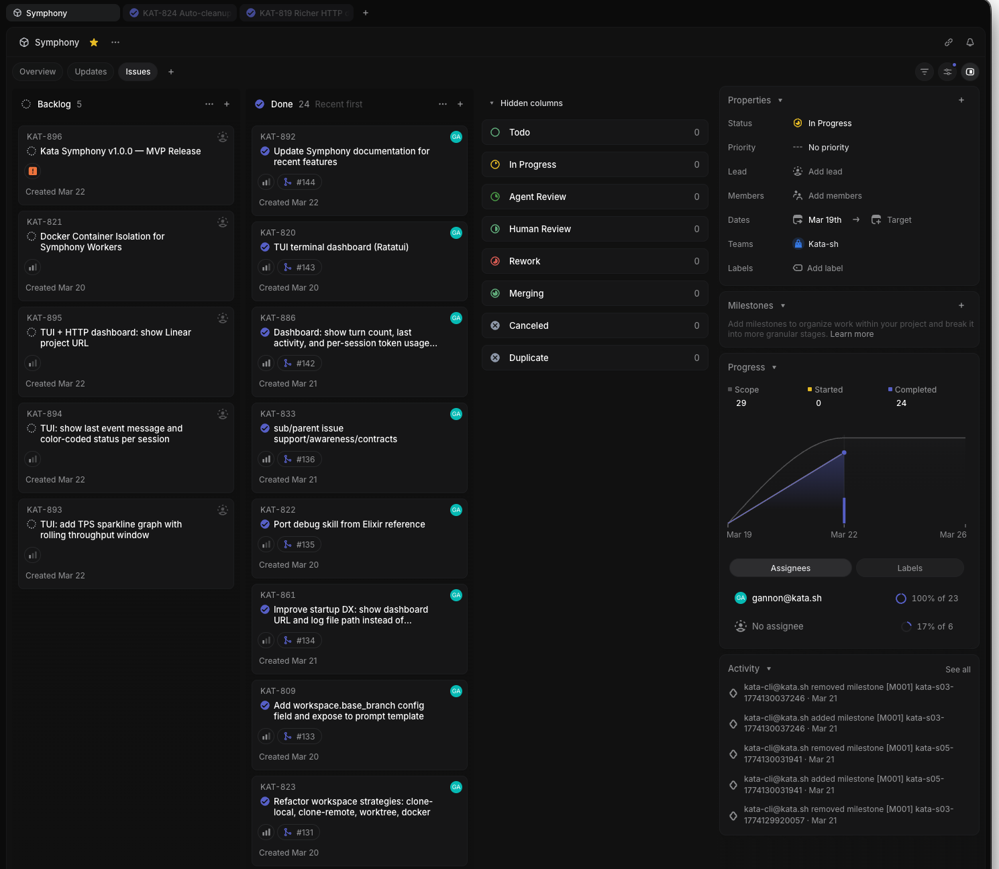

# Kata Symphony

Headless orchestrator that polls a Linear project for candidate issues and dispatches parallel agent sessions to work on them autonomously. Manages the full ticket lifecycle — from Todo through implementation, PR creation, automated code review, human review, and merge.


## Features

- **Linear integration** — polls for issues, manages state transitions, respects priorities and dependency graphs
- **Parallel agents** — configurable concurrency with per-state slot limits
- **Multi-turn sessions** — agents continue on the same Codex thread across turns, preserving conversation history
- **Full PR lifecycle** — agents create PRs, address review feedback, resolve comment threads, and merge
- **Real-time event streaming** — events flow from workers to the orchestrator as they happen
- **Dynamic config reload** — WORKFLOW.md changes take effect without restart
- **Workspace strategies** — clone-local (fast, hard-links), clone-remote (network), or worktree (lightweight)
- **Workspace cleanup** — auto-remove workspaces when issues reach terminal state
- **Rotating log files** — structured JSON logs to disk with rotation via `--logs-root`
- **SSH worker pools** — distribute sessions across remote machines
- **HTTP dashboard + JSON API** — live session table with turn/activity/session-token observability, retry queue, polling stats, and a Linear project link in the summary panel
- **Terminal dashboard (default-on)** — Ratatui observability view with throughput sparkline, color-coded session status dots, and Linear project URL; disable with `--no-tui`

<details>
<summary>HTTP Dashboard</summary>


</details>

## Installation

### Pre-built binaries

Download from [GitHub Releases](https://github.com/gannonh/kata/releases):

| Platform | Binary |
|---|---|
| macOS (Apple Silicon) | `symphony-macos-arm64` |
| Linux (x86_64) | `symphony-linux-x86_64` |
| Windows (x86_64) | `symphony-windows-x86_64.exe` |

```bash
# Example: macOS Apple Silicon
curl -L https://github.com/gannonh/kata/releases/latest/download/symphony-macos-arm64 -o symphony
chmod +x symphony
```

### Build from source

Requires [Rust toolchain](https://rustup.rs/):

```bash
git clone https://github.com/gannonh/kata.git
cd kata/apps/symphony
cargo build --release
# Binary at: target/release/symphony
```

## Quick Start

```bash
# 1. Configure
cp .env.example .env
# Edit .env with your Linear API key

# 2. Create your workflow
cp docs/WORKFLOW-REFERENCE.md WORKFLOW.md
# Edit WORKFLOW.md — set your project slug, repo URL, agent config

# 3. Run
./target/release/symphony WORKFLOW.md --port 8080
```

On startup, Symphony prints a summary banner:

```
Symphony v1.0.1
Dashboard: http://127.0.0.1:8080
Logs: stdout
Project: 89d4761fddf0
Workers: 3 max concurrent
Polling: every 30s

Press Ctrl+C to stop.
```

## CLI Flags

```
symphony [WORKFLOW.md] [--port PORT] [--logs-root PATH] [--no-tui]
```

| Flag | Default | Description |
|---|---|---|
| `WORKFLOW.md` (positional) | `WORKFLOW.md` | Path to the workflow configuration file |
| `--port PORT` | `8080` | HTTP dashboard and API port. Overrides `server.port` in config |
| `--logs-root PATH` | *(none)* | Directory for rotating log files. Suppresses stdout log streaming |
| `--no-tui` | `false` | Disable the Ratatui terminal dashboard. Without this flag, TUI is enabled by default |

Legacy compatibility: `--tui` is still accepted as a no-op.

### Log verbosity

Control with `RUST_LOG`:

```bash
RUST_LOG=info symphony WORKFLOW.md                    # default
RUST_LOG=debug symphony WORKFLOW.md                   # verbose
RUST_LOG=symphony=trace,info symphony WORKFLOW.md     # trace symphony, info everything else
```

When `--logs-root` is set, logs write to rotating files under `<logs-root>/log/symphony.log` and stdout shows only the startup banner. Without `--logs-root`, stdout logs are suppressed while the default TUI is active; pass `--no-tui` to stream structured JSON logs to stdout instead.

## Multiple Workflows

Symphony reads one workflow file per instance. Use the workflow file as the
execution contract for each project:

| Workflow file | Project | Dispatch model |
|---|---|---|
| `WORKFLOW.md` | Symphony | Flat tickets (single issue per run) |
| `cli-WORKFLOW.md` | Kata CLI | Slice-aware parent issue with ordered child tasks and hierarchy docs |

`WORKFLOW.md` remains the default flat-ticket workflow for Symphony self-build
work. `cli-WORKFLOW.md` adds parent/child issue awareness and document-loading
rules for Kata CLI planned slices.

Run different projects with different workflows:

```bash
# Self-build workflow (flat tickets)
symphony WORKFLOW.md --port 8080

# Kata CLI workflow (slice-aware, parent/child issues)
symphony cli-WORKFLOW.md --port 8080
```

If you run both at the same time, use different ports:

```bash
symphony WORKFLOW.md --port 8080
symphony cli-WORKFLOW.md --port 8081
```

Each workflow has its own tracker configuration, workspace settings, and prompt
template.

## Ticket Lifecycle

```
Todo → In Progress → Agent Review (bot feedback) → Human Review → Merging → Done
                                                    ↳ Agent Review (human feedback) ↲
                                                    ↳ Rework → In Progress
```

| Status | Set by | What happens |
|---|---|---|
| Todo | Human | Queued for agent work |
| In Progress | Orchestrator | Agent is implementing |
| Agent Review | Agent/Human | Agent addresses PR review comments |
| Human Review | Agent | PR is clean, waiting for human approval |
| Merging | Human | Agent merges the approved PR |
| Rework | Human | Agent scraps current approach, starts fresh |
| Done | Agent | Terminal — PR merged |



## Linear Setup

**Important:** Disable Linear's "auto-close parent when all sub-issues are done" automation. Symphony agents move child task issues to Done individually during execution, but the parent slice issue must stay active until the PR is created, reviewed, and merged. If Linear auto-closes the parent, the orchestrator will stop dispatching the agent before the work is complete.

## Configuration

All configuration lives in a `WORKFLOW.md` file — YAML front-matter for settings, markdown body for the agent prompt template.

See [`docs/WORKFLOW-REFERENCE.md`](docs/WORKFLOW-REFERENCE.md) for the fully documented reference template with all settings.

Key settings:

```yaml
tracker:
  kind: linear
  api_key: $LINEAR_API_KEY
  project_slug: "your-project-slug"
  # assignee: alice              # filter to one user (name, email, or "me")

workspace:
  root: ~/symphony-workspaces
  repo: https://github.com/you/repo.git
  git_strategy: auto              # auto, clone-local, clone-remote, worktree
  isolation: local                # local or docker
  branch_prefix: symphony
  clone_branch: main
  cleanup_on_done: true           # auto-remove workspaces on terminal state
  docker:
    image: symphony-worker:latest
    setup: docker/setups/rust.sh
    codex_auth: auto              # auto, mount, env
    env:
      - CARGO_HOME=/usr/local/cargo
    volumes:
      - ~/.ssh:/root/.ssh:ro

agent:
  max_concurrent_agents: 3
  max_turns: 20

codex:
  command: codex app-server
  stall_timeout_ms: 900000
  approval_policy: never

server:
  port: 8080
```

### Workspace Strategies

| Strategy | Command | Best for |
|---|---|---|
| `auto` (default) | Picks based on repo URL vs path | General use |
| `clone-local` | `git clone --local` | Monorepo on same volume — fast, inherits remotes |
| `clone-remote` | `git clone --single-branch` | Remote repos, full isolation |
| `worktree` | `git worktree add` | Monorepo — instant setup, visible in git clients |

**Note:** `clone-local` requires repo and workspace root on the same filesystem (hard links). `worktree` requires repo to be a local path.

## Docker Deployment

Symphony supports container-isolated workers with `workspace.isolation: docker`. The orchestrator starts a disposable worker container per issue, runs Codex via `docker exec -i`, and removes the container when the session finishes.

### Local

```bash
cd apps/symphony/docker
cp .env.example .env
# edit .env with required keys
docker compose up --build
```

### VPS

```bash
git clone https://github.com/gannonh/kata.git
cd kata/apps/symphony/docker
cp .env.example .env
# edit .env
docker compose up -d --build
```

### Custom worker images and setup scripts

- Base worker image is `docker/Dockerfile.worker`.
- `workspace.docker.image` selects the base image tag.
- `workspace.docker.setup` points to a setup script; Symphony caches a derived image based on setup script content hash.
- Bundled setup scripts live in `docker/setups/` (`rust.sh`, `python.sh`, `go.sh`, `bun.sh`).

### Docker auth modes

- `codex_auth: auto` uses `OPENAI_API_KEY` when set, otherwise mounts `~/.codex/auth.json`.
- `codex_auth: mount` requires `~/.codex/auth.json`.
- `codex_auth: env` requires `OPENAI_API_KEY`.

## Dashboard

The HTTP dashboard at `localhost:<port>` shows:

- **Summary cards** — running, retry, claimed, completed counts
- **Token summary** — input/output/total token usage
- **Running sessions table** — identifier, Linear state, status, attempt, elapsed time, turn count/max turns, last activity age, per-session tokens, workspace, worker host
- **Retry queue** — pending retries with errors and timing
- **Completed issues** — ticket identifier, title, completion date
- **Polling stats** — last poll time, poll count, interval
- **Rate limits** — Codex API rate limit data
- **Linear project link** — direct link card to the configured Linear project

Auto-refreshes every 2 seconds. JSON API at `/api/v1/state` and `/api/v1/{ISSUE-ID}`.

## Development

```bash
# Build
cargo build

# Test (321 tests)
cargo test

# Lint
cargo clippy -- -D warnings

# Format
cargo fmt
```

See [AGENTS.md](AGENTS.md) for full architecture reference, module layout, test harness details, and development conventions.
