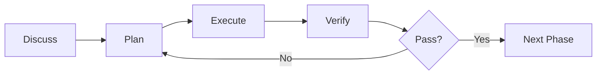

## What Makes Kata Different

Kata is a **meta-prompting and context engineering system** designed to help Claude build software systematically. It's not just a collection of prompts—it's a complete framework for managing context, orchestrating agents, and maintaining quality throughout development.

## Core Principles

### Plans ARE Prompts

PLAN.md files are executable XML documents optimized for Claude, not prose documents to be transformed into something else. When the executor agent reads a plan, it's reading its instructions directly.

```xml
<task type="auto">
  <name>Create login endpoint</name>
  <files>src/app/api/auth/login/route.ts</files>
  <action>
    Use jose for JWT (not jsonwebtoken - CommonJS issues).
    Validate credentials against users table.
    Return httpOnly cookie on success.
  </action>
  <verify>curl -X POST localhost:3000/api/auth/login returns 200 + Set-Cookie</verify>
  <done>Valid credentials return cookie, invalid return 401</done>
</task>
```

### Files Teach Claude

Every file in Kata serves dual purposes:

1. **Runtime functionality** — Loaded by Claude during execution
2. **Teaching material** — Shows Claude how to build software systematically

When you read a Kata workflow file, you're seeing both what Claude does and how it learned to do it.

### Context Engineering

Claude's quality degrades as context fills up. Kata manages this deliberately:

| Context Level | Quality    | Strategy                  |
| ------------- | ---------- | ------------------------- |
| 0-30%         | Peak       | Orchestrators stay here   |
| 30-50%        | Good       | Acceptable for light work |
| 50-70%        | Degrading  | Time to wrap up           |
| 70%+          | Poor       | Spawn fresh agent         |

Orchestrators coordinate. Agents execute with fresh 200k token windows.

## Architecture Components

### Skills

Skills are the primary interface for all Kata workflows. They respond to both natural language and explicit slash command invocation.

```bash
# Natural language
"Plan phase 2"

# Explicit command (plugin)
/kata:planning-phases 2

# Explicit command (NPX)
/kata-planning-phases 2
```

Each skill is a thin orchestrator that spawns specialized agents for heavy lifting.

**Learn more:** [Skills](/core-concepts/skills)

### Agents

Specialized subagents spawned by skills for specific tasks:

- `kata-planner` — Creates execution plans
- `kata-executor` — Implements tasks
- `kata-verifier` — Checks work against goals
- `kata-debugger` — Diagnoses failures

Agents work in fresh context windows. The orchestrator never accumulates garbage.

**Learn more:** [Agents](/core-concepts/agents)

### Templates

Structured output formats that ensure consistency:

- `PROJECT.md` — Project vision, always loaded
- `PLAN.md` — Atomic task with XML structure
- `SUMMARY.md` — What happened, committed to history
- `STATE.md` — Decisions, blockers, memory across sessions

Templates define what good output looks like.

**Learn more:** [Templates](/core-concepts/templates)

### Planning System

Kata's planning system breaks work into phases, then phases into plans:

1. **Phase** — A conceptual grouping (e.g., "User Authentication")
2. **Plan** — 2-3 atomic tasks that fit in fresh context
3. **Task** — Specific implementation with verification

Plans are sized to keep quality high. Split triggers: >3 tasks, multiple subsystems, >5 files per task.

**Learn more:** [Planning](/core-concepts/planning)

## The Kata Loop

Every phase follows the same pattern:



### Discuss (Optional)

Capture implementation decisions before planning. The system identifies gray areas and asks targeted questions. Output feeds directly into research and planning.

### Plan

Research → Plan → Verify loop. Planner creates atomic task plans, checker verifies against requirements, iterate until they pass.

### Execute

Run plans in parallel waves with fresh context per plan. Each task gets its own atomic commit.

### Verify

Manual user acceptance testing. You confirm features work as expected. Failures trigger automatic debugging and fix plan generation.

## Context Flow

Understanding how context flows through the system:

```
PROJECT.md (always loaded)
    ↓
Orchestrator spawns Agent with:
    - PROJECT.md
    - REQUIREMENTS.md
    - Current phase context
    - Specific instructions
    ↓
Agent works in fresh 200k window
    ↓
Agent returns results
    ↓
Orchestrator integrates
    ↓
Main context still at ~30%
```

**The orchestrator never does heavy lifting.** It spawns, waits, integrates.

## State Management

Kata maintains state across sessions:

| File                   | Purpose                                     |
| ---------------------- | ------------------------------------------- |
| `STATE.md`             | Living memory (decisions, blockers, position) |
| `ROADMAP.md`           | Where you're going, what's done             |
| `agent-history.json`   | Subagent tracking for resume                |
| `SUMMARY.md` frontmatter | Machine-readable for dependency graphs    |

Read `STATE.md` first in every session. Update it when making decisions.

## Quality Constraints

Size limits based on where Claude's quality degrades:

- **Plans:** 2-3 tasks maximum
- **Context usage:** Orchestrators stay under 30%
- **Task scope:** >5 files → split
- **Phase scope:** >3 plans → consider splitting

**Key insight:** Splitting isn't overhead. It's how you maintain quality.

## Next Steps

<CardGroup cols={2}>
  <Card
    title="Skills"
    icon="terminal"
    href="/core-concepts/skills"
  >
    Learn about the primary interface for Kata workflows
  </Card>
  <Card
    title="Agents"
    icon="robot"
    href="/core-concepts/agents"
  >
    Understand specialized subagents and orchestration
  </Card>
  <Card
    title="Templates"
    icon="file"
    href="/core-concepts/templates"
  >
    Explore structured output formats
  </Card>
  <Card
    title="Planning"
    icon="diagram-project"
    href="/core-concepts/planning"
  >
    Deep dive into the planning system
  </Card>
</CardGroup>
