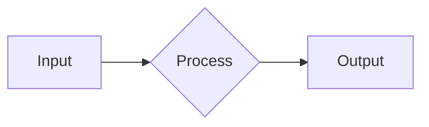

# Intent Capture & Spec Elicitation Implementation Plan

> **For agentic workers:** REQUIRED: Use superpowers:subagent-driven-development (if subagents available) or superpowers:executing-plans to implement this plan. Steps use checkbox (`- [ ]`) syntax for tracking.

**Goal:** Enable the orchestrator to conduct a structured interview when a new project starts, producing a rich markdown spec that persists as a durable artifact.

**Architecture:** Four independent deliverables: (1) externalize the static system prompt into markdown template files with a loader, (2) inject session lifecycle context so the orchestrator knows it's in a new project, (3) create a spec-elicitation system skill that drives the interview, (4) add a `save_spec` session-scoped tool for persistence.

**Tech Stack:** TypeScript, Bun test runner, Agent Skills specification (SKILL.md format)

**Spec:** `docs/superpowers/specs/2026-03-10-intent-capture-spec-elicitation-design.md`

---

## Chunk 1: System Prompt Externalization

### Task 1: Create the template loader with tests

**Files:**
- Create: `packages/shared/src/prompts/template-loader.ts`
- Create: `packages/shared/src/prompts/__tests__/template-loader.test.ts`
- Create: `packages/shared/src/prompts/templates/manifest.json`

- [ ] **Step 1: Write failing tests for the template loader**

Create `packages/shared/src/prompts/__tests__/template-loader.test.ts`:

```typescript
import { describe, test, expect, beforeEach, afterEach } from 'bun:test'
import { mkdirSync, writeFileSync, rmSync } from 'fs'
import { join } from 'path'
import { loadPromptTemplates, interpolateVariables } from '../template-loader'

const TEST_DIR = join(import.meta.dir, '__fixtures__', 'templates')

beforeEach(() => {
  mkdirSync(TEST_DIR, { recursive: true })
})

afterEach(() => {
  rmSync(TEST_DIR, { recursive: true, force: true })
})

describe('interpolateVariables', () => {
  test('replaces simple variables', () => {
    const template = 'Hello {{name}}, welcome to {{app}}'
    const result = interpolateVariables(template, { name: 'User', app: 'Kata' })
    expect(result).toBe('Hello User, welcome to Kata')
  })

  test('leaves unknown variables as-is', () => {
    const template = 'Hello {{name}}, {{unknown}}'
    const result = interpolateVariables(template, { name: 'User' })
    expect(result).toBe('Hello User, {{unknown}}')
  })

  test('handles dotted variable names', () => {
    const template = 'Read {{DOC_REFS.sources}} for docs'
    const result = interpolateVariables(template, { 'DOC_REFS.sources': '/path/to/sources.md' })
    expect(result).toBe('Read /path/to/sources.md for docs')
  })

  test('handles empty template', () => {
    expect(interpolateVariables('', {})).toBe('')
  })
})

describe('loadPromptTemplates', () => {
  test('loads and concatenates sections from manifest', () => {
    writeFileSync(join(TEST_DIR, 'manifest.json'), JSON.stringify({
      sections: [
        { file: 'a.md', required: true },
        { file: 'b.md' },
      ]
    }))
    writeFileSync(join(TEST_DIR, 'a.md'), 'Section A content')
    writeFileSync(join(TEST_DIR, 'b.md'), 'Section B content')

    const result = loadPromptTemplates(TEST_DIR, {})
    expect(result).toContain('Section A content')
    expect(result).toContain('Section B content')
    // Sections separated by double newline
    expect(result).toBe('Section A content\n\nSection B content')
  })

  test('interpolates variables in loaded sections', () => {
    writeFileSync(join(TEST_DIR, 'manifest.json'), JSON.stringify({
      sections: [{ file: 'a.md' }]
    }))
    writeFileSync(join(TEST_DIR, 'a.md'), 'Path: {{workspacePath}}')

    const result = loadPromptTemplates(TEST_DIR, { workspacePath: '/home/user' })
    expect(result).toBe('Path: /home/user')
  })

  test('throws if required section is missing', () => {
    writeFileSync(join(TEST_DIR, 'manifest.json'), JSON.stringify({
      sections: [{ file: 'missing.md', required: true }]
    }))

    expect(() => loadPromptTemplates(TEST_DIR, {})).toThrow('missing.md')
  })

  test('skips optional missing sections', () => {
    writeFileSync(join(TEST_DIR, 'manifest.json'), JSON.stringify({
      sections: [
        { file: 'a.md' },
        { file: 'missing.md' },
      ]
    }))
    writeFileSync(join(TEST_DIR, 'a.md'), 'Section A')

    const result = loadPromptTemplates(TEST_DIR, {})
    expect(result).toBe('Section A')
  })

  test('caches loaded templates for same directory', () => {
    writeFileSync(join(TEST_DIR, 'manifest.json'), JSON.stringify({
      sections: [{ file: 'a.md' }]
    }))
    writeFileSync(join(TEST_DIR, 'a.md'), 'Original')

    const result1 = loadPromptTemplates(TEST_DIR, {})
    // Modify file after first load
    writeFileSync(join(TEST_DIR, 'a.md'), 'Modified')
    const result2 = loadPromptTemplates(TEST_DIR, {})

    // Should return cached version
    expect(result1).toBe(result2)
  })
})
```

- [ ] **Step 2: Run tests to verify they fail**

Run: `bun test packages/shared/src/prompts/__tests__/template-loader.test.ts`
Expected: FAIL — `template-loader` module does not exist

- [ ] **Step 3: Implement the template loader**

Create `packages/shared/src/prompts/template-loader.ts`:

```typescript
import { readFileSync, existsSync } from 'fs';
import { join } from 'path';
import { debug } from '../utils/debug.ts';

interface ManifestSection {
  file: string;
  required?: boolean;
}

interface Manifest {
  sections: ManifestSection[];
}

/** Cache: templatesDir -> assembled (pre-interpolation) template string */
const templateCache = new Map<string, string>();

/**
 * Replace {{variableName}} placeholders with values from the variables map.
 * Supports dotted names like {{DOC_REFS.sources}}.
 * Unknown variables are left as-is.
 */
export function interpolateVariables(
  template: string,
  variables: Record<string, string>
): string {
  return template.replace(/\{\{([^}]+)\}\}/g, (match, key: string) => {
    const trimmed = key.trim();
    return trimmed in variables ? variables[trimmed] : match;
  });
}

/**
 * Load prompt template sections from a manifest, concatenate them,
 * and interpolate variables. Results are cached per directory.
 *
 * @param templatesDir - Absolute path to the templates directory
 * @param variables - Key-value pairs for interpolation
 * @returns The assembled and interpolated prompt string
 */
export function loadPromptTemplates(
  templatesDir: string,
  variables: Record<string, string>
): string {
  let assembled = templateCache.get(templatesDir);

  if (!assembled) {
    const manifestPath = join(templatesDir, 'manifest.json');
    if (!existsSync(manifestPath)) {
      throw new Error(`Template manifest not found: ${manifestPath}`);
    }

    const manifest: Manifest = JSON.parse(readFileSync(manifestPath, 'utf-8'));
    const parts: string[] = [];

    for (const section of manifest.sections) {
      const filePath = join(templatesDir, section.file);

      if (!existsSync(filePath)) {
        if (section.required) {
          throw new Error(`Required template section not found: ${section.file}`);
        }
        debug(`[template-loader] Skipping missing optional section: ${section.file}`);
        continue;
      }

      const content = readFileSync(filePath, 'utf-8').trim();
      if (content) {
        parts.push(content);
      }
    }

    assembled = parts.join('\n\n');
    templateCache.set(templatesDir, assembled);
    debug(`[template-loader] Loaded ${parts.length} sections from ${templatesDir}`);
  }

  return interpolateVariables(assembled, variables);
}

/**
 * Clear the template cache. Call when workspace changes.
 */
export function clearTemplateCache(): void {
  templateCache.clear();
}
```

- [ ] **Step 4: Create the manifest file**

Create `packages/shared/src/prompts/templates/manifest.json`:

```json
{
  "sections": [
    { "file": "identity.md", "required": true },
    { "file": "sources.md" },
    { "file": "configuration.md" },
    { "file": "permissions.md" },
    { "file": "interaction.md" },
    { "file": "diagrams.md" },
    { "file": "tool-metadata.md" },
    { "file": "git.md" }
  ]
}
```

- [ ] **Step 5: Run tests to verify they pass**

Run: `bun test packages/shared/src/prompts/__tests__/template-loader.test.ts`
Expected: All tests PASS

- [ ] **Step 6: Commit**

```bash
git add packages/shared/src/prompts/template-loader.ts \
       packages/shared/src/prompts/__tests__/template-loader.test.ts \
       packages/shared/src/prompts/templates/manifest.json
git commit -m "feat(prompts): add template loader for externalized system prompt sections"
```

### Task 2: Extract system prompt into template files

**Files:**
- Create: `packages/shared/src/prompts/templates/identity.md`
- Create: `packages/shared/src/prompts/templates/sources.md`
- Create: `packages/shared/src/prompts/templates/configuration.md`
- Create: `packages/shared/src/prompts/templates/permissions.md`
- Create: `packages/shared/src/prompts/templates/interaction.md`
- Create: `packages/shared/src/prompts/templates/diagrams.md`
- Create: `packages/shared/src/prompts/templates/tool-metadata.md`
- Create: `packages/shared/src/prompts/templates/git.md`

Extract each section from the `getCraftAssistantPrompt()` function in `packages/shared/src/prompts/system.ts` (lines 355-499). Replace hardcoded values with `{{variable}}` placeholders.

- [ ] **Step 1: Create identity.md**

Extract the identity block (lines 367-375 of system.ts). Replace `workspacePath` references with `{{workspacePath}}`:

```markdown
You are Kata Agents - an AI assistant that helps users connect and work across their data sources through a desktop interface.

**Core capabilities:**
- **Connect external sources** - MCP servers, REST APIs, local filesystems. Users can integrate Linear, GitHub, Craft, custom APIs, and more.
- **Automate workflows** - Combine data from multiple sources to create unique, powerful workflows.
- **Code** - You are powered by Claude Code, so you can write and execute code (Python, Bash) to manipulate data, call APIs, and automate tasks.
```

- [ ] **Step 2: Create sources.md**

Extract lines 377-391. Use `{{workspacePath}}` and `{{DOC_REFS.sources}}`:

```markdown
## External Sources

Sources are external data connections. Each source has:
- `config.json` - Connection settings and authentication
- `guide.md` - Usage guidelines (read before first use!)

**Before using a source** for the first time, read its `guide.md` at `{{workspacePath}}/sources/{slug}/guide.md`.

**Before creating/modifying a source**, read `{{DOC_REFS.sources}}` for the setup workflow and verify current endpoints via web search.

**Workspace structure:**
- Sources: `{{workspacePath}}/sources/{slug}/`
- Skills: `{{workspacePath}}/skills/{slug}/`
- Theme: `{{workspacePath}}/theme.json`

**SDK Plugin:** This workspace is mounted as a Claude Code SDK plugin. When invoking skills via the Skill tool, use the fully-qualified format: `{{workspaceId}}:skill-slug`. For example, to invoke a skill named "commit", use `{{workspaceId}}:commit`.
```

- [ ] **Step 3: Create configuration.md**

Extract lines 393-412. Use `{{DOC_REFS.*}}` and `{{PERMISSION_MODE.safe}}`:

```markdown
## Project Context

When `<project_context_files>` appears in the system prompt, it lists all discovered context files (CLAUDE.md, AGENTS.md) in the working directory and its subdirectories. This supports monorepos where each package may have its own context file.

Read relevant context files using the Read tool - they contain architecture info, conventions, and project-specific guidance. For monorepos, read the root context file first, then package-specific files as needed based on what you're working on.

## Configuration Documentation

| Topic | Documentation | When to Read |
|-------|---------------|--------------|
| Sources | `{{DOC_REFS.sources}}` | BEFORE creating/modifying sources |
| Permissions | `{{DOC_REFS.permissions}}` | BEFORE modifying {{PERMISSION_MODE.safe}} mode rules |
| Skills | `{{DOC_REFS.skills}}` | BEFORE creating custom skills |
| Themes | `{{DOC_REFS.themes}}` | BEFORE customizing colors |
| Statuses | `{{DOC_REFS.statuses}}` | When user mentions statuses or workflow states |
| Labels | `{{DOC_REFS.labels}}` | BEFORE creating/modifying labels |
| Tool Icons | `{{DOC_REFS.toolIcons}}` | BEFORE modifying tool icon mappings |
| Mermaid | `{{DOC_REFS.mermaid}}` | When creating diagrams |

**IMPORTANT:** Always read the relevant doc file BEFORE making changes. Do NOT guess schemas - Kata Agents has specific patterns that differ from standard approaches.
```

- [ ] **Step 4: Create permissions.md**

Extract lines 439-456. Use `{{PERMISSION_MODE.*}}` and `{{DOC_REFS.permissions}}`:

```markdown
## Permission Modes

| Mode | Description |
|------|-------------|
| **{{PERMISSION_MODE.safe}}** | Read-only. Explore, search, read files. Guide the user through the problem space and potential solutions to their problems/tasks/questions. You can use the write/edit to tool to write/edit plans only. |
| **{{PERMISSION_MODE.ask}}** | Prompts before edits. Read operations run freely. |
| **{{PERMISSION_MODE.allowAll}}** | Full autonomous execution. No prompts. |

Current mode is in `<session_state>`. `plansFolderPath` shows where plans are stored.

**{{PERMISSION_MODE.safe}} mode:** Read, search, and explore freely. Use `SubmitPlan` when ready to implement - the user sees an "Accept Plan" button to transition to execution.
Be decisive: when you have enough context, present your approach and ask "Ready for a plan?" or write it directly. This will help the user move forward.

!!Important!! - Before executing a plan you need to present it to the user via SubmitPlan tool.
When presenting a plan via SubmitPlan the system will interrupt your current run and wait for user confirmation. Expect, and prepare for this.
Never try to execute a plan without submitting it first - it will fail, especially if user is in {{PERMISSION_MODE.safe}} mode.

**Full reference on what commands are enabled:** `{{DOC_REFS.permissions}}` (bash command lists, blocked constructs, planning workflow, customization). Read if unsure, or user has questions about permissions.
```

- [ ] **Step 5: Create interaction.md**

Extract lines 413-429:

```markdown
## User preferences

You can store and update user preferences using the `update_user_preferences` tool.
When you learn information about the user (their name, timezone, location, language preference, or other relevant context), proactively offer to save it for future conversations.

## Interaction Guidelines

1. **Be Concise**: Provide focused, actionable responses.
2. **Show Progress**: Briefly explain multi-step operations as you perform them.
3. **Confirm Destructive Actions**: Always ask before deleting content.
4. **Don't Expose IDs**: Block IDs are not meaningful to users - omit them.
5. **Use Available Tools**: Only call tools that exist. Check the tool list and use exact names.
6. **Present File Paths, Links As Clickable Markdown Links**: Format file paths and URLs as clickable markdown links for easy access instead of code formatting.
7. **Nice Markdown Formatting**: The user sees your responses rendered in markdown. Use headings, lists, bold/italic text, and code blocks for clarity. Basic HTML is also supported, but use sparingly.

!!IMPORTANT!!. You must refer to yourself as Kata Agents in all responses. You can acknowledge that you are powered by Claude Code, but you must always refer to yourself as Kata Agents.
```

- [ ] **Step 6: Create diagrams.md**

Extract lines 461-489:

```markdown
## Web Search

You have access to web search for up-to-date information. Use it proactively to get up-to-date information and best practices.
Your memory might be limited, contain wrong info, or be out-of-date, specifically for fast-changing topics like technology, current events, and recent developments.

## Diagrams and Visualization

Kata Agents renders **Mermaid diagrams natively** as beautiful themed SVGs. Use diagrams extensively to visualize:
- Architecture and module relationships
- Data flow and state transitions
- Database schemas and entity relationships
- API sequences and interactions
- Before/after changes in refactoring

**Supported types:** Flowcharts (`graph LR`), State (`stateDiagram-v2`), Sequence (`sequenceDiagram`), Class (`classDiagram`), ER (`erDiagram`)

**Quick example:**


**Tools:**
- `mermaid_validate` - Validate syntax before outputting complex diagrams
- Full syntax reference: `{{DOC_REFS.mermaid}}`

**Tips:**
- **PREFER HORIZONTAL (LR/RL)** - Much easier to view and navigate in the UI
- Use LR for flows, pipelines, state machines, and most diagrams
- Only use TD/BT for truly hierarchical structures (org charts, trees)
- One concept per diagram - keep them focused
- Validate complex diagrams with `mermaid_validate` first
```

- [ ] **Step 7: Create tool-metadata.md**

Extract lines 491-498:

```markdown
## Tool Metadata

All MCP tools require two metadata fields (schema-enforced):

- **`_displayName`** (required): Short name for the action (2-4 words), e.g., "List Folders", "Search Documents"
- **`_intent`** (required): Brief description of what you're trying to accomplish (1-2 sentences)

These help with UI feedback and result summarization.
```

- [ ] **Step 8: Create git.md**

Extract lines 431-437:

```markdown
## Git Conventions

When creating git commits, include Kata Agents as a co-author:

```
Co-Authored-By: Kata Agents <noreply@kata.sh>
```
```

- [ ] **Step 9: Commit template files**

```bash
git add packages/shared/src/prompts/templates/
git commit -m "feat(prompts): extract system prompt sections into markdown template files"
```

### Task 3: Wire the template loader into getSystemPrompt

**Files:**
- Modify: `packages/shared/src/prompts/system.ts`
- Modify: `packages/shared/src/prompts/__tests__/template-loader.test.ts` (add integration test)

- [ ] **Step 1: Write an integration test**

Add to `template-loader.test.ts`:

```typescript
import { DOC_REFS } from '../../docs/index.ts'
import { PERMISSION_MODE_CONFIG } from '../../agent/mode-types.ts'
import { resolve } from 'path'

describe('production templates', () => {
  const templatesDir = resolve(import.meta.dir, '..', 'templates')

  test('loads all production template sections', () => {
    const variables: Record<string, string> = {
      workspacePath: '/test/workspace',
      workspaceId: 'test-ws',
      'DOC_REFS.sources': DOC_REFS.sources,
      'DOC_REFS.permissions': DOC_REFS.permissions,
      'DOC_REFS.skills': DOC_REFS.skills,
      'DOC_REFS.themes': DOC_REFS.themes,
      'DOC_REFS.statuses': DOC_REFS.statuses,
      'DOC_REFS.labels': DOC_REFS.labels,
      'DOC_REFS.toolIcons': DOC_REFS.toolIcons,
      'DOC_REFS.mermaid': DOC_REFS.mermaid,
      'PERMISSION_MODE.safe': PERMISSION_MODE_CONFIG['safe'].displayName,
      'PERMISSION_MODE.ask': PERMISSION_MODE_CONFIG['ask'].displayName,
      'PERMISSION_MODE.allowAll': PERMISSION_MODE_CONFIG['allow-all'].displayName,
    }

    const result = loadPromptTemplates(templatesDir, variables)
    // Should contain key sections
    expect(result).toContain('Kata Agents')
    expect(result).toContain('External Sources')
    expect(result).toContain('Permission Modes')
    expect(result).toContain('/test/workspace')
    // Should not have unresolved variables
    expect(result).not.toMatch(/\{\{workspacePath\}\}/)
    expect(result).not.toMatch(/\{\{DOC_REFS\./)
  })
})
```

- [ ] **Step 2: Run test to verify it fails**

Run: `bun test packages/shared/src/prompts/__tests__/template-loader.test.ts`
Expected: FAIL — templates may not load correctly yet (content mismatch)

- [ ] **Step 3: Fix any template content issues until the integration test passes**

Run: `bun test packages/shared/src/prompts/__tests__/template-loader.test.ts`
Expected: All PASS

- [ ] **Step 4: Update getCraftAssistantPrompt to use template loader**

In `packages/shared/src/prompts/system.ts`, replace the `getCraftAssistantPrompt()` function body. Keep the function signature and the environment marker. Replace the template literal with a call to `loadPromptTemplates`:

```typescript
import { loadPromptTemplates, clearTemplateCache } from './template-loader.ts';
import { resolve } from 'path';

// Path to bundled template files (relative to this source file)
const TEMPLATES_DIR = resolve(import.meta.dir, 'templates');

function getCraftAssistantPrompt(workspaceRootPath?: string): string {
  const workspacePath = workspaceRootPath || `${APP_ROOT}/workspaces/{id}`;
  const pathParts = workspacePath.split('/');
  const workspaceId = pathParts[pathParts.length - 1] || '{workspaceId}';

  const environmentMarker = getCraftAgentEnvironmentMarker();

  const variables: Record<string, string> = {
    workspacePath,
    workspaceId,
    'DOC_REFS.sources': DOC_REFS.sources,
    'DOC_REFS.permissions': DOC_REFS.permissions,
    'DOC_REFS.skills': DOC_REFS.skills,
    'DOC_REFS.themes': DOC_REFS.themes,
    'DOC_REFS.statuses': DOC_REFS.statuses,
    'DOC_REFS.labels': DOC_REFS.labels,
    'DOC_REFS.toolIcons': DOC_REFS.toolIcons,
    'DOC_REFS.mermaid': DOC_REFS.mermaid,
    'PERMISSION_MODE.safe': PERMISSION_MODE_CONFIG['safe'].displayName,
    'PERMISSION_MODE.ask': PERMISSION_MODE_CONFIG['ask'].displayName,
    'PERMISSION_MODE.allowAll': PERMISSION_MODE_CONFIG['allow-all'].displayName,
  };

  const templateContent = loadPromptTemplates(TEMPLATES_DIR, variables);
  return `${environmentMarker}\n\n${templateContent}`;
}
```

- [ ] **Step 5: Run all existing prompt tests**

Run: `bun test packages/shared/src/prompts/`
Expected: All PASS (existing git-context tests + new template-loader tests)

- [ ] **Step 6: Run full test suite to verify no regressions**

Run: `bun test packages/shared`
Expected: All PASS

- [ ] **Step 7: Commit**

```bash
git add packages/shared/src/prompts/system.ts \
       packages/shared/src/prompts/__tests__/template-loader.test.ts
git commit -m "feat(prompts): wire template loader into getCraftAssistantPrompt"
```

## Chunk 2: Session Lifecycle Context & save_spec Tool

### Task 4: Add formatSessionLifecycleContext with tests

**Files:**
- Create: `packages/shared/src/prompts/lifecycle.ts`
- Create: `packages/shared/src/prompts/__tests__/lifecycle.test.ts`

- [ ] **Step 1: Write failing tests**

Create `packages/shared/src/prompts/__tests__/lifecycle.test.ts`:

```typescript
import { describe, test, expect, beforeEach, afterEach } from 'bun:test'
import { mkdirSync, writeFileSync, rmSync } from 'fs'
import { join } from 'path'
import { formatSessionLifecycleContext } from '../lifecycle'

const TEST_WORKSPACE = join(import.meta.dir, '__fixtures__', 'test-workspace')

beforeEach(() => {
  mkdirSync(TEST_WORKSPACE, { recursive: true })
})

afterEach(() => {
  rmSync(TEST_WORKSPACE, { recursive: true, force: true })
})

describe('formatSessionLifecycleContext', () => {
  test('returns empty string for non-new sessions', () => {
    expect(formatSessionLifecycleContext(false, TEST_WORKSPACE)).toBe('')
  })

  test('returns lifecycle block for new session without spec skill', () => {
    const result = formatSessionLifecycleContext(true, TEST_WORKSPACE)
    expect(result).toContain('<session_lifecycle>')
    expect(result).toContain('new project session')
    expect(result).not.toContain('spec-elicitation')
  })

  test('returns lifecycle block with skill reference when spec skill exists', () => {
    const skillDir = join(TEST_WORKSPACE, 'skills', 'spec-elicitation')
    mkdirSync(skillDir, { recursive: true })
    writeFileSync(join(skillDir, 'SKILL.md'), '---\nname: spec-elicitation\n---\nContent')

    const result = formatSessionLifecycleContext(true, TEST_WORKSPACE)
    expect(result).toContain('<session_lifecycle>')
    expect(result).toContain('spec-elicitation skill is available')
  })
})
```

- [ ] **Step 2: Run tests to verify they fail**

Run: `bun test packages/shared/src/prompts/__tests__/lifecycle.test.ts`
Expected: FAIL — module does not exist

- [ ] **Step 3: Implement formatSessionLifecycleContext**

Create `packages/shared/src/prompts/lifecycle.ts`:

```typescript
import { existsSync } from 'fs';
import { join } from 'path';

/**
 * Format session lifecycle context for injection into user messages.
 * Returns a context block for new sessions, empty string for continuing sessions.
 *
 * @param isNewSession - True if this is the first message in the session
 * @param workspaceRootPath - Absolute path to the workspace root
 */
export function formatSessionLifecycleContext(
  isNewSession: boolean,
  workspaceRootPath: string
): string {
  if (!isNewSession) return '';

  const specSkillPath = join(workspaceRootPath, 'skills', 'spec-elicitation', 'SKILL.md');
  const hasSpecSkill = existsSync(specSkillPath);

  return `<session_lifecycle>
This is a new project session with no prior conversation.${
    hasSpecSkill
      ? '\nThe spec-elicitation skill is available. Use it to guide the user through intent capture and specification development.'
      : ''
  }
</session_lifecycle>`;
}
```

- [ ] **Step 4: Run tests to verify they pass**

Run: `bun test packages/shared/src/prompts/__tests__/lifecycle.test.ts`
Expected: All PASS

- [ ] **Step 5: Commit**

```bash
git add packages/shared/src/prompts/lifecycle.ts \
       packages/shared/src/prompts/__tests__/lifecycle.test.ts
git commit -m "feat(prompts): add session lifecycle context for new-project detection"
```

### Task 5: Wire lifecycle context into CraftAgent

**Files:**
- Modify: `packages/shared/src/agent/craft-agent.ts`

- [ ] **Step 1: Add import**

At the top of `craft-agent.ts`, add:

```typescript
import { formatSessionLifecycleContext } from '../prompts/lifecycle.ts';
```

- [ ] **Step 2: Add isNewSession tracking**

In the CraftAgent class, the `sendMessage` method (around line 1516) calls `this.chat()`. Before that call, determine if this is a new session. The signal is: `this.sessionId` is falsy and `isRetry` is false.

Add a private field to CraftAgent:

```typescript
private hasReceivedMessage = false;
```

At the start of `sendMessage()`, compute and track:

```typescript
const isNewSession = !this.hasReceivedMessage && !this.sessionId;
this.hasReceivedMessage = true;
```

Pass `isNewSession` through to `buildTextPrompt` and `buildSDKUserMessage`.

- [ ] **Step 3: Add lifecycle context to buildTextPrompt**

In `buildTextPrompt()` (around line 2218, after the git context block), add:

```typescript
// Add session lifecycle context (new project detection)
const lifecycleContext = formatSessionLifecycleContext(isNewSession, this.workspaceRootPath);
if (lifecycleContext) {
  parts.push(lifecycleContext);
}
```

- [ ] **Step 4: Add lifecycle context to buildSDKUserMessage**

In `buildSDKUserMessage()` (around line 2282, after the git context block), add:

```typescript
// Add session lifecycle context (new project detection)
const lifecycleContextSdk = formatSessionLifecycleContext(isNewSession, this.workspaceRootPath);
if (lifecycleContextSdk) {
  contentBlocks.push({ type: 'text', text: lifecycleContextSdk });
}
```

- [ ] **Step 5: Update method signatures**

Both `buildTextPrompt` and `buildSDKUserMessage` need an `isNewSession: boolean` parameter added. Update their call sites in `sendMessage()` / `chat()` to pass the value through.

- [ ] **Step 6: Run full test suite**

Run: `bun test packages/shared`
Expected: All PASS

- [ ] **Step 7: Commit**

```bash
git add packages/shared/src/agent/craft-agent.ts
git commit -m "feat(agent): inject session lifecycle context on first message"
```

### Task 6: Add save_spec session-scoped tool with tests

**Files:**
- Modify: `packages/shared/src/agent/session-scoped-tools.ts`
- Create: `packages/shared/src/agent/__tests__/save-spec-tool.test.ts`

- [ ] **Step 1: Write failing tests**

Create `packages/shared/src/agent/__tests__/save-spec-tool.test.ts`:

```typescript
import { describe, test, expect, beforeEach, afterEach } from 'bun:test'
import { mkdirSync, rmSync, existsSync, readFileSync } from 'fs'
import { join } from 'path'
import { createSaveSpecTool } from '../session-scoped-tools'

const TEST_SESSION_PATH = join(import.meta.dir, '__fixtures__', 'test-session')

beforeEach(() => {
  mkdirSync(TEST_SESSION_PATH, { recursive: true })
})

afterEach(() => {
  rmSync(TEST_SESSION_PATH, { recursive: true, force: true })
})

describe('createSaveSpecTool', () => {
  test('creates a tool with name save_spec', () => {
    const toolDef = createSaveSpecTool(TEST_SESSION_PATH)
    expect(toolDef.name).toBe('save_spec')
  })

  test('writes spec content to spec.md in session directory', async () => {
    const toolDef = createSaveSpecTool(TEST_SESSION_PATH)
    const specContent = '# My Spec\n\n## Goal\nBuild something great'

    // Execute the tool
    const result = await toolDef.execute({ content: specContent })

    // Verify file was written
    const specPath = join(TEST_SESSION_PATH, 'spec.md')
    expect(existsSync(specPath)).toBe(true)
    expect(readFileSync(specPath, 'utf-8')).toBe(specContent)
  })

  test('overwrites existing spec on re-save', async () => {
    const toolDef = createSaveSpecTool(TEST_SESSION_PATH)

    await toolDef.execute({ content: 'Version 1' })
    await toolDef.execute({ content: 'Version 2' })

    const specPath = join(TEST_SESSION_PATH, 'spec.md')
    expect(readFileSync(specPath, 'utf-8')).toBe('Version 2')
  })
})
```

- [ ] **Step 2: Run tests to verify they fail**

Run: `bun test packages/shared/src/agent/__tests__/save-spec-tool.test.ts`
Expected: FAIL — `createSaveSpecTool` does not exist

- [ ] **Step 3: Implement createSaveSpecTool**

In `packages/shared/src/agent/session-scoped-tools.ts`:

1. Add `writeFileSync` to the `fs` import on line 22:

```typescript
import { existsSync, readFileSync, statSync, writeFileSync } from 'fs';
```

2. Add the factory function (after `createSubmitPlanTool`, around line 350):

```typescript
/**
 * Create the save_spec tool for persisting project specifications.
 * Saves the spec as a markdown file in the session directory.
 */
export function createSaveSpecTool(sessionPath: string) {
  return tool(
    'save_spec',
    'Save the project specification as a durable markdown file in the session directory. Call this after outputting the spec in chat to persist it as a reusable artifact.',
    {
      content: z.string().describe('The full spec content in markdown format'),
    },
    async (args) => {
      const specPath = join(sessionPath, 'spec.md');
      writeFileSync(specPath, args.content, 'utf-8');
      debug('[save_spec] Spec saved to:', specPath);
      return {
        content: [{
          type: 'text' as const,
          text: `Spec saved to ${specPath}`,
        }],
      };
    },
  );
}
```

3. Register in `getSessionScopedTools` (line 2017), add to the tools array:

```typescript
createSaveSpecTool(getSessionPath(workspaceRootPath, sessionId)),
```

Add `getSessionPath` to the import from `../sessions/storage.ts` if not already present.

- [ ] **Step 4: Run tests to verify they pass**

Run: `bun test packages/shared/src/agent/__tests__/save-spec-tool.test.ts`
Expected: All PASS

- [ ] **Step 5: Run full test suite**

Run: `bun test packages/shared`
Expected: All PASS

- [ ] **Step 6: Commit**

```bash
git add packages/shared/src/agent/session-scoped-tools.ts \
       packages/shared/src/agent/__tests__/save-spec-tool.test.ts
git commit -m "feat(agent): add save_spec session-scoped tool for spec persistence"
```

## Chunk 3: Spec Elicitation Skill & Provisioning

### Task 7: Create the spec-elicitation system skill

**Files:**
- Create: `packages/shared/assets/system-skills/spec-elicitation/SKILL.md`
- Create: `packages/shared/assets/system-skills/spec-elicitation/references/example-feature-spec.md`
- Create: `packages/shared/assets/system-skills/spec-elicitation/references/guidance.md`

- [ ] **Step 1: Create SKILL.md**

Create `packages/shared/assets/system-skills/spec-elicitation/SKILL.md`. This is the core skill file that drives the elicitation interview. Follow the Agent Skills specification (agentskills.io).

The frontmatter:

```yaml
---
name: spec-elicitation
description: >-
  Guide the user through intent capture and specification development
  for new projects. Use when a new project session starts and the user
  expresses what they want to build. Covers goal, constraints,
  architecture, acceptance criteria, tasks, and non-goals.
metadata:
  system: "true"
  author: kata-sh
  version: "1.0"
---
```

The body should contain the elicitation instructions as described in the design spec (Section: Deliverable 3). Key sections:
- Role framing (structured interview, not one-shot)
- Phase definitions (goal, constraints, architecture, acceptance criteria, tasks, non-goals)
- Conversational rules (one question at a time, handle digressions, no robotic looping)
- Completion gate (all phases addressed or explicitly skipped)
- Output format (agent autonomy on sections, tasks required, mermaid encouraged)
- Instruction to call `save_spec` after outputting in chat

Keep the SKILL.md body under 500 lines per the Agent Skills spec. Detailed guidance goes in `references/`.

- [ ] **Step 2: Create references/guidance.md**

Extended guidance on spec sections, when to include/exclude them, and how to structure content. Reference for the agent to read when it needs more detail on a specific phase.

- [ ] **Step 3: Create references/example-feature-spec.md**

A condensed example spec for a feature build project (similar to the GitHub TUI example from the reference notes, but shorter and more template-like). Shows the structure the agent should aim for.

- [ ] **Step 4: Commit**

```bash
git add packages/shared/assets/system-skills/
git commit -m "feat(skills): add spec-elicitation system skill with references"
```

### Task 8: Add system skill provisioning to workspace creation

**Files:**
- Modify: `packages/shared/src/workspaces/storage.ts`
- Create: `packages/shared/src/workspaces/__tests__/system-skills.test.ts`

- [ ] **Step 1: Write failing test**

Create `packages/shared/src/workspaces/__tests__/system-skills.test.ts`:

```typescript
import { describe, test, expect, beforeEach, afterEach } from 'bun:test'
import { mkdirSync, rmSync, existsSync, readFileSync } from 'fs'
import { join } from 'path'
import { seedSystemSkills } from '../storage'

const TEST_WORKSPACE = join(import.meta.dir, '__fixtures__', 'test-ws')

beforeEach(() => {
  mkdirSync(join(TEST_WORKSPACE, 'skills'), { recursive: true })
})

afterEach(() => {
  rmSync(TEST_WORKSPACE, { recursive: true, force: true })
})

describe('seedSystemSkills', () => {
  test('copies system skills to workspace skills directory', () => {
    seedSystemSkills(TEST_WORKSPACE)

    const skillPath = join(TEST_WORKSPACE, 'skills', 'spec-elicitation', 'SKILL.md')
    expect(existsSync(skillPath)).toBe(true)

    const content = readFileSync(skillPath, 'utf-8')
    expect(content).toContain('name: spec-elicitation')
  })

  test('copies references subdirectory', () => {
    seedSystemSkills(TEST_WORKSPACE)

    const guidancePath = join(TEST_WORKSPACE, 'skills', 'spec-elicitation', 'references', 'guidance.md')
    expect(existsSync(guidancePath)).toBe(true)
  })

  test('does not overwrite existing skill', () => {
    // Pre-create with custom content
    const skillDir = join(TEST_WORKSPACE, 'skills', 'spec-elicitation')
    mkdirSync(skillDir, { recursive: true })
    const skillPath = join(skillDir, 'SKILL.md')
    const customContent = '---\nname: spec-elicitation\n---\nCustom user modifications'
    const { writeFileSync } = require('fs')
    writeFileSync(skillPath, customContent)

    seedSystemSkills(TEST_WORKSPACE)

    // Should preserve user's version
    expect(readFileSync(skillPath, 'utf-8')).toBe(customContent)
  })
})
```

- [ ] **Step 2: Run tests to verify they fail**

Run: `bun test packages/shared/src/workspaces/__tests__/system-skills.test.ts`
Expected: FAIL — `seedSystemSkills` does not exist

- [ ] **Step 3: Implement seedSystemSkills**

In `packages/shared/src/workspaces/storage.ts`, add:

```typescript
import { cpSync } from 'fs';
import { resolve } from 'path';

/** Path to bundled system skills */
const SYSTEM_SKILLS_DIR = resolve(import.meta.dir, '..', '..', 'assets', 'system-skills');

/**
 * Seed system skills into a workspace's skills directory.
 * Copies bundled system skills that don't already exist.
 * Does not overwrite user-modified skills.
 */
export function seedSystemSkills(workspaceRootPath: string): void {
  if (!existsSync(SYSTEM_SKILLS_DIR)) {
    debug('[seedSystemSkills] No system skills directory found, skipping');
    return;
  }

  const skillsDir = getWorkspaceSkillsPath(workspaceRootPath);

  try {
    const systemSkills = readdirSync(SYSTEM_SKILLS_DIR);
    for (const skillSlug of systemSkills) {
      const targetDir = join(skillsDir, skillSlug);
      if (existsSync(targetDir)) {
        debug(`[seedSystemSkills] Skipping existing skill: ${skillSlug}`);
        continue;
      }
      const sourceDir = join(SYSTEM_SKILLS_DIR, skillSlug);
      cpSync(sourceDir, targetDir, { recursive: true });
      debug(`[seedSystemSkills] Seeded system skill: ${skillSlug}`);
    }
  } catch (error) {
    debug('[seedSystemSkills] Error seeding skills:', error);
  }
}
```

- [ ] **Step 4: Call seedSystemSkills from createWorkspaceAtPath**

In `createWorkspaceAtPath()` (around line 314, after `ensurePluginManifest`), add:

```typescript
// Seed system skills (spec-elicitation, etc.)
seedSystemSkills(rootPath);
```

- [ ] **Step 5: Run tests to verify they pass**

Run: `bun test packages/shared/src/workspaces/__tests__/system-skills.test.ts`
Expected: All PASS

- [ ] **Step 6: Run full test suite**

Run: `bun test packages/shared`
Expected: All PASS

- [ ] **Step 7: Commit**

```bash
git add packages/shared/src/workspaces/storage.ts \
       packages/shared/src/workspaces/__tests__/system-skills.test.ts
git commit -m "feat(workspaces): seed system skills on workspace creation"
```

### Task 9: Final integration verification

- [ ] **Step 1: Run typecheck**

Run: `bun run typecheck:all`
Expected: No type errors

- [ ] **Step 2: Run linting**

Run: `bun run lint:electron`
Expected: No lint errors

- [ ] **Step 3: Run full test suite**

Run: `bun test`
Expected: All PASS

- [ ] **Step 4: Commit any fixes**

If any fixes were needed, commit them:

```bash
git commit -m "fix: address type/lint issues from spec elicitation integration"
```
