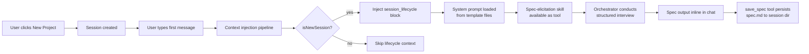

# KAT-292: Intent Capture and Orchestrator-Led Spec Elicitation

## Goal

Turn a user's intent into a rich orchestrator-owned spec through a deliberate human/agent collaborative process. The orchestrator conducts a structured interview when a new project starts, gathering enough information to produce a specification that can serve as the starting artifact for the spec-driven workflow.

## Approach

Skill + Lifecycle Signal + File Persistence (Approach B). The elicitation behavior lives in an editable skill file. A lifecycle context injection tells the orchestrator when it's in a new project. The finished spec persists as a file in the session directory.

## Architecture

Four deliverables:

1. **System prompt externalization** — extract static prompt content from TypeScript into markdown template files
2. **Session lifecycle context injection** — signal new-project state to the orchestrator via user message context
3. **Spec elicitation skill** — a SKILL.md file that drives the structured interview
4. **`save_spec` tool** — a session-scoped tool that persists the spec to the filesystem

### Data flow



## Deliverable 1: System Prompt Externalization

### Current state

One ~500-line template literal in `getCraftAssistantPrompt()` in `packages/shared/src/prompts/system.ts`. Changing any system prompt behavior requires editing TypeScript, rebuilding, and redeploying.

### Target state

Static prompt sections become markdown files in `packages/shared/src/prompts/templates/`:

```
packages/shared/src/prompts/templates/
├── manifest.json
├── identity.md
├── sources.md
├── configuration.md
├── permissions.md
├── interaction.md
├── diagrams.md
├── tool-metadata.md
└── git.md
```

Note: `session-lifecycle` is NOT a template file. It is a dynamic context injector (Deliverable 2) because its content depends on runtime state (new session vs. continuing session, skill availability). It lives in TypeScript alongside the other dynamic injectors.

### manifest.json

Controls load order and allows sections to be toggled:

```json
{
  "sections": [
    { "file": "identity.md", "required": true },
    { "file": "sources.md" },
    { "file": "configuration.md" },
    { "file": "permissions.md" },
    { "file": "interaction.md" },
    { "file": "diagrams.md" },
    { "file": "tool-metadata.md" },
    { "file": "git.md" }
  ]
}
```

### Loader

Replaces `getCraftAssistantPrompt()`. Reads the manifest, concatenates sections, interpolates variables. Variable syntax: `{{variableName}}`. Simple mustache-style replacement, no template engine dependency.

#### Template variables

The loader must support these variables:

| Variable | Source | Example |
|----------|--------|---------|
| `{{workspacePath}}` | Function parameter | `~/.kata-agents/workspaces/abc123` |
| `{{workspaceId}}` | Extracted from workspacePath | `abc123` |
| `{{DOC_REFS.sources}}` | `DOC_REFS` constant | `~/.kata-agents/docs/sources.md` |
| `{{DOC_REFS.permissions}}` | `DOC_REFS` constant | `~/.kata-agents/docs/permissions.md` |
| `{{DOC_REFS.skills}}` | `DOC_REFS` constant | `~/.kata-agents/docs/skills.md` |
| `{{DOC_REFS.themes}}` | `DOC_REFS` constant | `~/.kata-agents/docs/themes.md` |
| `{{DOC_REFS.statuses}}` | `DOC_REFS` constant | `~/.kata-agents/docs/statuses.md` |
| `{{DOC_REFS.labels}}` | `DOC_REFS` constant | `~/.kata-agents/docs/labels.md` |
| `{{DOC_REFS.toolIcons}}` | `DOC_REFS` constant | `~/.kata-agents/docs/tool-icons.md` |
| `{{DOC_REFS.mermaid}}` | `DOC_REFS` constant | `~/.kata-agents/docs/mermaid.md` |
| `{{PERMISSION_MODE.safe}}` | `PERMISSION_MODE_CONFIG` | `Explore` |
| `{{PERMISSION_MODE.ask}}` | `PERMISSION_MODE_CONFIG` | `Ask to Edit` |
| `{{PERMISSION_MODE.allowAll}}` | `PERMISSION_MODE_CONFIG` | `Auto` |

The environment marker (`getCraftAgentEnvironmentMarker()`) remains computed in TypeScript because it uses `process.platform`, `process.arch`, and `os.release()`. The loader prepends it before the template sections.

### What stays as TypeScript

Dynamic context injectors remain as code because they compute runtime values:
- `getDateTimeContext()` — current date/time
- `formatSessionState()` — permission mode, plans folder
- `formatSourceState()` — available data connections
- `formatWorkspaceCapabilities()` — local MCP enabled/disabled
- `getWorkingDirectoryContext()` — session working directory
- `formatGitContext()` — branch, PR info
- `formatSessionLifecycleContext()` — new (see Deliverable 2)

### Caching

`getCraftAssistantPrompt()` is not cached today; it rebuilds on every call but is pure/deterministic given its inputs. The SDK's prompt caching handles deduplication at the API level.

For the template loader, add file-read caching: read template files once and cache in memory. Invalidate when the workspace changes (same trigger as existing `getSystemPrompt()` calls with different `workspaceRootPath`). File modification time checks are not needed since templates ship with the app and don't change at runtime.

## Deliverable 2: Session Lifecycle Context Injection

### Goal

The orchestrator knows when it's in a new project (no prior messages) and that the spec-elicitation skill is available.

### Mechanism

A new function added to the context injection pipeline in `buildTextPrompt()` / `buildSDKUserMessage()`. Same pattern as working directory and git context.

```typescript
function formatSessionLifecycleContext(
  isNewSession: boolean,
  workspaceRootPath: string
): string {
  if (!isNewSession) return '';

  // Check for spec-elicitation skill on disk (avoids importing the skills loader)
  const specSkillPath = join(workspaceRootPath, 'skills', 'spec-elicitation', 'SKILL.md');
  const hasSpecSkill = existsSync(specSkillPath);

  return `<session_lifecycle>
This is a new project session with no prior conversation.
${hasSpecSkill
  ? 'The spec-elicitation skill is available. Use it to guide the user through intent capture and specification development.'
  : ''}
</session_lifecycle>`;
}
```

### Signal

CraftAgent does not maintain a message history; conversation state is managed by the Claude Agent SDK via `resume: this.sessionId`. The new-session signal is: `this.sessionId` is undefined/null (no prior SDK session to resume) and the call is not a retry. Concretely: `isNewSession = !this.sessionId && !isRetry`.

### Injection point

Slots into the existing pipeline alongside date/time, session state, working directory, and git context. Added to both `buildTextPrompt()` and `buildSDKUserMessage()`.

## Deliverable 3: Spec Elicitation Skill

### Location

```
~/.kata-agents/workspaces/{id}/skills/spec-elicitation/
├── SKILL.md
└── references/
    ├── example-feature-spec.md
    ├── example-investigation.md
    └── guidance.md
```

### Frontmatter

```yaml
---
name: spec-elicitation
description: >-
  Guide the user through intent capture and specification development
  for new projects. Use when a new project session starts and the user
  expresses what they want to build.
metadata:
  system: "true"
  author: kata-sh
  version: "1.0"
---
```

Follows the Agent Skills specification at agentskills.io. Custom fields use the `metadata` map. The `name` field must be lowercase with hyphens, matching the directory name.

### Body structure

The skill body defines the elicitation behavior:

1. **Role framing** — conducting a structured interview to turn intent into a specification, not answering a one-shot question.

2. **Phase definitions** — ordered checkpoints the agent must cover:
   - Goal — what are we building and why
   - Constraints — technical, timeline, platform, dependencies
   - Architecture — high-level system design (mermaid diagram encouraged)
   - Acceptance criteria — how do we know it's done
   - Tasks — discrete units of work (required section)
   - Non-goals — what's explicitly out of scope

3. **Conversational rules:**
   - One question at a time
   - Handle digressions gracefully: answer the user's question, then steer back naturally
   - Use the user's vocabulary
   - Multiple choice when it reduces ambiguity, open-ended when exploring
   - Do not loop robotically on the same question if the user redirects

4. **Completion gate** — the agent declares the spec "draft ready" when all phases have been addressed. Missing phases are acceptable if the agent explicitly notes them as intentionally omitted.

5. **Output format guidance:**
   - Agent has autonomy over which sections to include and how to structure them
   - Tasks section is required
   - Architecture diagram (mermaid) is strongly encouraged
   - Spec should be concise and project-shaped
   - After outputting the spec in chat, call `save_spec` to persist it

6. **Template examples** — in `references/`, 2-3 condensed example specs showing different project types for calibration.

### System skill convention

Ships as a regular workspace skill with `metadata.system: "true"`. No enforcement infrastructure built yet. The UI can read this flag later to display system skills differently. Users can edit the skill if they want to customize the elicitation flow.

### Provisioning

The skill must be seeded into each workspace's skills directory. On workspace creation (`SessionManager.createSession()` or workspace setup), copy the skill from a bundled template directory in the app:

```
packages/shared/assets/system-skills/spec-elicitation/
├── SKILL.md
└── references/
    ├── example-feature-spec.md
    ├── example-investigation.md
    └── guidance.md
```

The provisioning logic copies this directory to `~/.kata-agents/workspaces/{id}/skills/spec-elicitation/` if it does not already exist. This runs once per workspace and does not overwrite user modifications. Add this to the workspace creation flow in `packages/shared/src/workspaces/storage.ts`.

## Deliverable 4: save_spec Tool

### Purpose

Persists the finished spec as a durable markdown file in the session directory.

### Storage

```
~/.kata-agents/workspaces/{id}/sessions/{sessionId}/spec.md
```

Session-scoped because the spec belongs to the project (which maps to a session). Co-located with the session's JSONL, attachments, and plans.

### Implementation

A session-scoped tool registered in `session-scoped-tools.ts`, following the factory pattern used by `createSubmitPlanTool()`:

```typescript
export function createSaveSpecTool(sessionPath: string) {
  return tool('save_spec', {
    description: 'Save the project specification as a durable markdown file',
    schema: z.object({
      content: z.string().describe('The full spec content in markdown format'),
    }),
    execute: async ({ content }) => {
      const specPath = join(sessionPath, 'spec.md');
      writeFileSync(specPath, content, 'utf-8');
      return `Spec saved to ${specPath}`;
    },
  });
}
```

Add `writeFileSync` to the existing `fs` import in `session-scoped-tools.ts`. Register the tool in `createSessionScopedMcpServer()` alongside `createSubmitPlanTool()`.
```

### Why a dedicated tool

- Makes the action explicit and trackable in the event stream
- Lets KAT-273 (spec panel) listen for `save_spec` events to know when a spec is ready
- Keeps the storage path deterministic

## Scope Boundaries

### In scope (KAT-292)

- System prompt externalization (template files + loader + variable interpolation)
- Session lifecycle context injection (new-project detection)
- Spec elicitation skill (SKILL.md + references)
- `save_spec` session-scoped tool
- Spec output inline in chat

### Out of scope

- Spec panel/tab UI (KAT-273)
- Task decomposition and sub-agent assignment (KAT-275)
- Sub-agent-owned task markdown files (KAT-281)
- Formal system skill infrastructure (separate storage, loading precedence, UI distinction)
- Spec state machine beyond "file exists or doesn't"

## Testing

- Unit tests for the template loader (reads manifest, interpolates variables, caches result)
- Unit tests for `formatSessionLifecycleContext()` (new session vs. continuing session)
- Unit tests for `save_spec` tool (writes file to correct path)
- Integration test: new session with spec-elicitation skill produces lifecycle context in first message
- Manual UAT: create a new project, verify the orchestrator enters interview mode and produces a spec

## Key Files to Modify

| File | Change |
|------|--------|
| `packages/shared/src/prompts/system.ts` | Replace `getCraftAssistantPrompt()` with template loader |
| `packages/shared/src/prompts/templates/` | New directory with manifest + section files |
| `packages/shared/src/agent/craft-agent.ts` | Add lifecycle context to `buildTextPrompt()` / `buildSDKUserMessage()` |
| `packages/shared/src/agent/session-scoped-tools.ts` | Add `save_spec` tool (factory pattern, add `writeFileSync` import) |
| `packages/shared/assets/system-skills/` | Bundled system skill templates for provisioning |
| `packages/shared/src/workspaces/storage.ts` | Seed system skills on workspace creation |
| Workspace skills directory | Ship `spec-elicitation/` skill |
