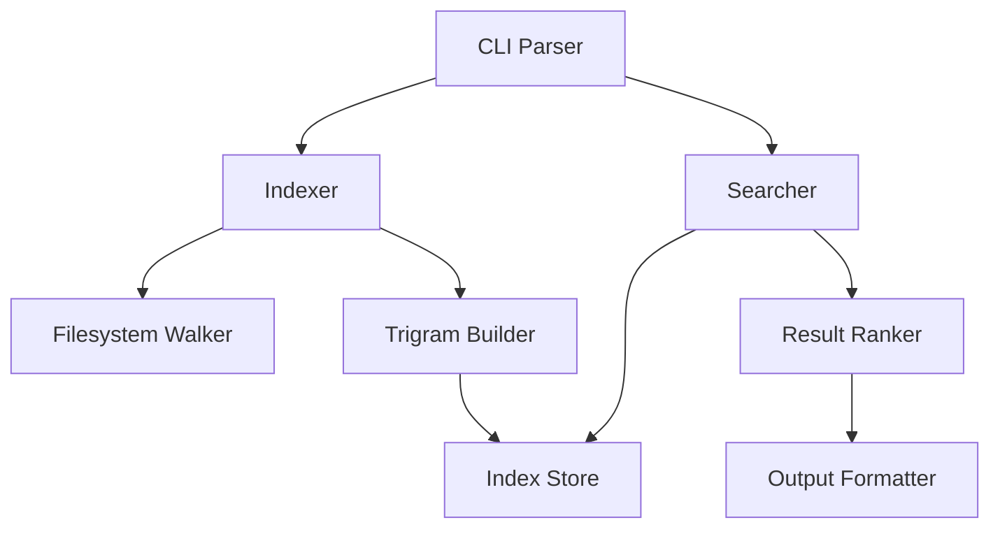

# Example Spec: git-search CLI

## Goal

Build a CLI tool that searches across multiple local git repositories by
content, file name, and commit message. Developers working with many repos
need a single command to find code without opening each repo individually.

## Constraints

- Written in Rust for single-binary distribution
- Must run on macOS and Linux (Windows is a non-goal)
- Uses a trigram index for sub-second search on repos up to 10GB total
- No daemon process; index is built on first run and updated incrementally
- Output format follows ripgrep conventions for tool integration

## Architecture

The CLI dispatches to either the indexer or searcher based on the subcommand.
The index store is a binary file per repository stored in `~/.git-search/`.
The searcher reads the index, filters by query, and ranks results by recency
and match density.

## Tasks

- [ ] **1. CLI scaffolding** — Set up the Rust project with clap. Define
  subcommands: `index`, `search`, `status`. Parse common flags (path, format,
  ignore patterns). No business logic yet.
- [ ] **2. Filesystem walker** — Recursively walk a directory tree respecting
  `.gitignore` rules. Emit file paths and contents as a stream. Handle
  symlinks and binary file detection.
- [ ] **3. Trigram index builder** — Consume the file stream, build a trigram
  index, and serialize to a binary format in `~/.git-search/`. Support
  incremental updates using file modification times.
- [ ] **4. Search engine** — Load the index, evaluate trigram queries, and
  return candidate files. Post-filter candidates with exact matching.
- [ ] **5. Result ranking and formatting** — Rank results by match count and
  file recency. Format output as `file:line:content` (ripgrep style). Support
  `--json` flag for structured output.
- [ ] **6. Multi-repo orchestration** — Accept a config file listing repo
  paths. Index and search across all repos. Merge and deduplicate results.
- [ ] **7. Integration tests** — Test against fixture repos with known
  content. Cover: fresh index, incremental update, multi-repo search,
  `.gitignore` exclusion, binary file skipping.

## Acceptance Criteria

- [ ] `git-search index ~/repos/myproject` builds an index in under 5s for a
  repo with 50k files
- [ ] `git-search search "handleRequest"` returns results in under 200ms
  against an indexed 10GB corpus
- [ ] Results include file path, line number, and 3-line context window
- [ ] `.gitignore` patterns are respected during indexing
- [ ] Binary files are detected and excluded automatically
- [ ] `--json` flag outputs newline-delimited JSON matching ripgrep's schema
- [ ] Incremental re-index skips unmodified files
- [ ] Exit code 0 for matches found, 1 for no matches, 2 for errors

## Non-goals

- Windows support (may be added later but not in this scope)
- Remote repository search (only local clones)
- Language-aware search or AST parsing
- GUI or TUI interface
